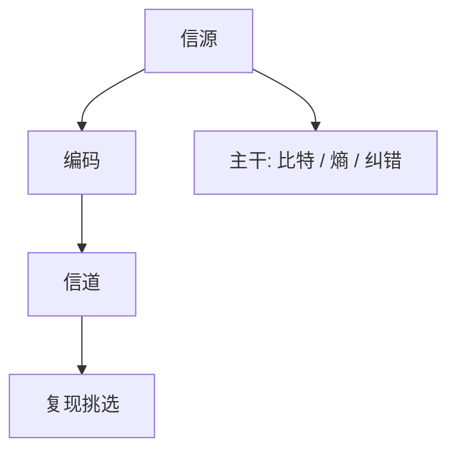

# Shannon 通信

通信是从有限集合里复现一次挑选；比特度量选择，噪声下的可靠速率有上限。

<footer>—— Shannon, A Mathematical Theory of Communication, Bell System Technical Journal 1948</footer>

[上一课](/cs/von-neumann-edvac)附录对照了存储程序草案。附录对照，不插入主干。主干已在[比特作为区分](/cs/von-neumann-edvac)、[信息量与熵](/cs/entropy-bits)、[纠错码直觉](/cs/error-correcting-intuition)里用过字母表、熵与噪声；这里对照 **1948 原文的问题**：如何把通信从电路噪声里抽成数学，使信源编码与信道编码分开。不重推熵公式。

## 问题

主干第一课钉的是二元区分；熵课才引入分布。Shannon 原文的缺口是整条链：信源、编码器、信道、复现，以及两条定理——压缩不能低于熵，噪声信道有容量。这不是 EDVAC 的结构图，也不是可计算性。1949 年保密论文是另一篇，对称加密课已经点名。

比特在 1948 里是信息量的单位，也是二元符号。主干第一课故意先只取符号，把熵留给后课，避免第一课变成概率。

## 方法

信源：随机过程，熵率。无噪声：编码长度下界为熵。信道：转移概率，容量 $C=\max I(X;Y)$。有噪声：码率低于容量则可任意可靠。主干纠错课只取直觉（冗余对抗翻转），不把随机编码证明插进课序。

## 机制

区分「符号」与「信息量」之后，压缩与纠错可以分家：一个去掉信源冗余，一个按信道加受控冗余。主干网络课的校验和只防随机错，与 Shannon 码不是同一对象；安全课的哈希更不是。本附录只对照原文如何切开这两层。

### 为何对照而不插入主干

若把 1948 全文插在反相器之前，组成课会被信息论拖住。主干只要：先有区分，再有熵，再有纠错直觉。附录对照定理的分工，以及 1949 保密论与 1948 通信论不是同一篇。

## 边界

不要发明 arXiv 号，也不要把微信里的「信息」口语写成熵。下一篇对照 Knuth 如何把算法与分析写成多卷本，那是数据与算法主干已经用过的分析风格。

连续信道的容量公式与本栏离散比特课不是同一页演算；主干只取离散字母表这一层。

对照结束应回到主干[比特作为区分](/cs/bit-as-distinction)与[信息量与熵](/cs/entropy-bits)。容量证明不插入纠错直觉课。

## 小结

- 附录对照 Shannon 1948：通信 = 复现挑选；熵与容量分家。
- 主干比特、熵、纠错课已取用；本篇不插入第一课之前。
- 1949 保密论另见对称加密课。
- 出处：Shannon, *BSTJ* 27, 1948。
