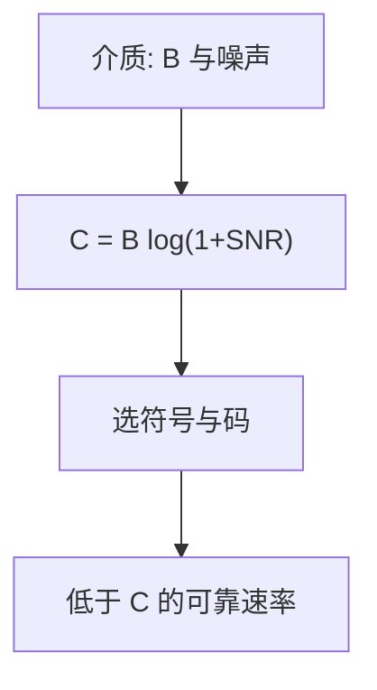

# 香农容量在链路

带宽 $B$ 与信噪比把可靠速率钉死在 $C=B\log_2(1+S/N)$；链路的波特、编码与重传都在这个上界下面找工程点。

<footer>—— 据 Shannon, Communication in the Presence of Noise, Proc. IRE 1949；Nyquist, 1928 整理</footer>

[上一课](/cs/distributed-os-intuition)把操作系统进阶收到「没有透明分布式 Unix」。主干网络已从[分层](/cs/layering-e2e)走到[套接字](/cs/socket-api)，帧与 MAC 当 PDU 用，还没有把一跳的比特率接到信息论。[信道容量](/cs/channel-capacity)在离散 BSC 上给过 $C=\max I(X;Y)$。缺口是**链路上的香农公式**：铜缆、光纤这一跳能可靠运送多少比特，后课调制与线路码都相对这个预算说话。后课默认已经读完本课。不重写 Transformer，不进限价簿。

## 问题

教学五层把物理层写成「比特上介质」。介质有噪声、有限带宽。Nyquist：无噪声、$M$ 电平、带宽 $B$ 时符号率不超过 $2B$，比特率 $2B\log_2 M$。Shannon：加性高斯噪声下 $C=B\log_2(1+\mathrm{SNR})$，与具体电平表无关。主干以太网课假定「链路有速率」；本课把速率还原成 $B$ 与 SNR 的函数，而不是网卡说明书上的营销数字。

不要把 $C$ 写成「已经达到的吞吐量」。吞吐是 MAC、队列与上层窗口之后的结果。

Shannon 1948 给互信息容量；1949 年 IRE 文把带限高斯信道写成工程常用的 $B\log(1+\mathrm{SNR})$。Kurose and Ross 物理层章用同一公式对照拨号与以太网。本课不重证随机编码。

### 容量不是标称速率

网卡上的 Gb/s 已扣掉编码与 FEC，并且默认误码可忽略；那是工作点，不是 $C$ 本身。后课调制与线路码都在这个预算下面移动，不改写香农公式。

## 方法

一跳：给定频谱占用 $B$（电缆类别、光通道间隔）与可达到的 SNR（发射功率、衰减、接收机噪声系数）。$C$ 是可靠速率上界。工程码（后课 8B/10B、FEC）用冗余换距离，使工作点低于 $C$ 且错误可忽略。画：介质 → $B$ 与 SNR → $C$ → 再选调制阶数。

方法止于选定对象与对照；机制才说它如何嵌入已有分层与主干课。

## 机制

主干[帧](/cs/frame-mac)的比特是已经判决后的符号流。判决之前，物理层必须先把波形放进 $B$，并对抗噪声。容量把「加冗余」从 CRC 检错升到：整条链路的净信息率不能超过 $C$。CRC 仍只覆盖一帧；容量管的是符号流的渐近可靠速率。

与信息论课的分工：那里 $C$ 是存在性；这里 $C$ 是选电缆、光功率与 PAM 阶数时的预算。分离原理仍成立：链路 FEC 不必替 TCP 做端到端校验。

## 边界

本课不引入 ISI 均衡的抽头公式，不把 5G NR 的资源块当容量证明。也不把量化金融或 Transformer 注意力写成「信道」。后课默认：一跳的可靠速率以 $C$ 为界；下一课用调制把 $C$ 拆成符号率与每符号比特。

容量是互信息上界在带限链路上的实例，不是某款光模块的标称 Gb/s。标称速率已经含码开销与裕量。

上一课留下的缺口在本课收口；「香农容量在链路」进入后课词汇表后只引用。文献用来钉对象与边界，不把本课写成该主题的独立综述。下一课[调制与符号率](/cs/modulation-symbol-rate)。

## 小结

- 链路预算：$C=B\log_2(1+\mathrm{SNR})$；Nyquist 管无噪声符号率。
- 帧里的比特是 $C$ 之下的工程点，不是上界本身。
- 主干网络假定「有速率」；本课把速率接到 $B$ 与噪声。
- 后课只引用本课钉死的对象，不从该领域总问题重开。
- 出处：Shannon, 1949；Nyquist, 1928；Kurose and Ross。
