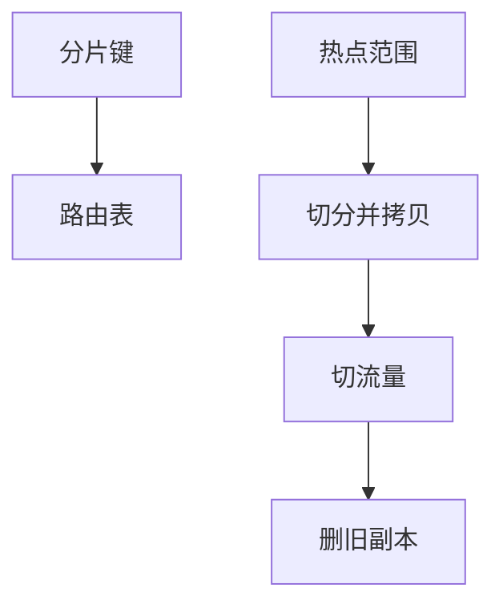

# 分片键与再平衡

分片键决定行落在哪一故障域；再平衡把键范围从过热节点搬走。选错键，再平衡永远在救热点。

<footer>—— 据主干 sharding 直觉；DeWitt and Gray 并行库；一致性哈希后课</footer>

复制续在[读己之写](/cs/replication-lag-rmw)封口。本课打开分布式数据库：单库分区课已水平切；分片把切放到**多进程多机**，提交与故障域分裂。主干 [分片直觉](/cs/sharding) 点到水平切。缺口是键选择与再平衡（rebalance）时的数据搬家与路由。

## 问题

键：用户 id 哈希均匀但范围查询打全分片；时间范围利于裁剪但最新分区过热。复合键（租户+时间）折中。缺口是**路由元数据**：谁拥有哪些范围，客户端或协调器查表。再平衡：切范围、拷贝、切流量、删旧——与模式迁移的扩展-收缩同构，加上网络与双写窗口。

跨分片事务：2PC 或确定性定序，本课不重写协议，只承认键一旦让多数事务跨片，分片失败。

单调主键写入打在最大范围片上，与 IOT 热叶同一病。哈希打散写、毁范围。本课权衡。

## 方法

先量事务：是否带候选键。再选哈希/范围/目录（lookup）。再平衡尽量在线：新片先跟复制，再改路由，再删。一致性哈希下一课专门减搬家量。

二级索引全局 vs 本地：全局索引本身要分片，写放大；本地索引查询可能扫所有片。

## 机制

读己之写：跨片更难，会话要记每片 LSN 或只读主片。计划：优化器有「分片裁剪」，无键谓词 scatter-gather 全片，代价像未分区表×N。

再平衡时约束：唯一性跨片要全局索引或键包含唯一列。

## 边界

本课不讲 shuffle join 算法细节——下一课。也不把分片当 5NF。NewSQL 后课把分片+SQL 打成产品族。

后课默认：分片键对齐事务边界；再平衡是带路由版本的搬家。shuffle 与 broadcast join：跨片连接如何运数据。

热点不是硬件不够，是键的时间局部性与切法冲突。

## 小结

- 分片键权衡均匀与裁剪；跨片事务比例是失败指标。
- 再平衡=拷贝+切路由；元数据要有版本。
- shuffle 与 broadcast join 下一课。
- 出处：DeWitt and Gray；主干 sharding；分区课对照。
