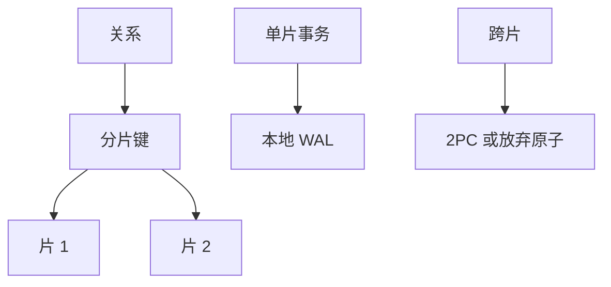

# 分片直觉

按键把关系水平切开，每片一台机器；片内仍是事务与 WAL，片间默认没有同一套 ACID。

<footer>—— 据 Gray 对规模；Ramakrishnan 对水平划分；对照 2PC 的代价</footer>

[上一课](/cs/replication-log)用日志做同一历史的副本。本课不重做同步复制。缺口是容量与写吞吐：复制不减小单片数据量。分片（sharding）按分片键划分元组。跨片查询是连接与 2PC 的边界。数据库课在此结束，下一课 CIA。

## 问题

复制留下「多份同一数据」。写仍然打在主片的那一份上，磁盘与 CPU 仍线性涨。水平切分：`hash(k) mod N` 或按范围。请求路由用键；没有键的查询要打所有片或维护二级索引。缺口是**把关系当成可切开的集合**，以及跨片事务不再免费。

垂直切分是按列分文件，对象不同。本课水平。再均衡（reshard）要搬元组与日志点，是运维缺口，不展开成手册。

## 方法

选分片键使常见事务落在单片（如用户 id）。片内 [严格 2PL](/cs/strict-2pl) 与 ARIES 照旧。跨片原子用 2PC 或改成最终一致。外键跨片难以强制，[参照动作](/cs/fk-actions) 常退回应用。查询计划多一层：先剪枝片，再在片上优化。

## 机制

分片把[页与槽](/cs/page-slot) 的局部性限制在一片内，网络成为新的「寻道」。副本可以每片一套，与分片正交。安全课将开始：切分不提供保密，只改变攻击面形状。

## 边界

本课不把 NewSQL 全球时间戳当主干必选。提交可以正确，报文仍可被窃听——下一课 CIA 三元组。

后课默认：库可以水平切开。安全课换敌手模型，不再补一种分片算法。

## 小结

- 水平分片按键切开；片内事务，片间需 2PC 或弱化。
- 复制与分片正交。
- 计算机栏下一课进入 CIA。
- 出处：Gray；Ramakrishnan and Gehrke；对照 Bernstein 对 2PC。
