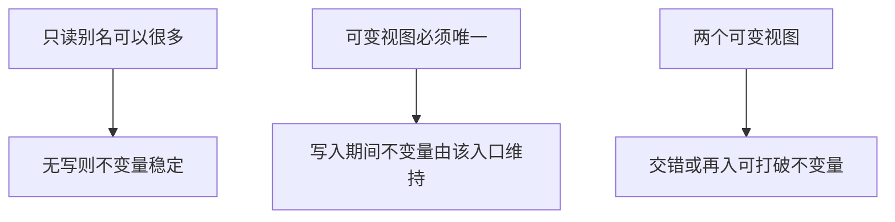

# 并发之前：共享可变

两个活着的指针指向同一可变对象时，不变量必须对每一次写入同时成立；线程只是把这个事实变成交错执行。

<footer>—— 据 Kernighan & Ritchie, The C Programming Language, 2nd ed.；ISO/IEC 9899；Bryant and O'Hallaron, Computer Systems: A Programmer's Perspective 整理</footer>

上一课[资源获取即初始化](/cs/raii)要求每个资源同一时刻只有一个主人。本课不重讲销毁，也不从锁与内存模型另起。缺口是：别名课已经允许两个指针指向同一对象，封装要求只通过公开函数写——**若两个调用方同时拿着可变视图，不变量在两次调用之间对谁成立**。这是并发的前置，本身还没有线程。

## 问题

单线程里，共享可变已经能打破不变量：`foo_append(a, x)` 进行到一半时，若回调或函数指针再次进入 `foo_*`，对象处于半更新。可重入与否是接口性质。缺口因此不是「以后有多核」，而是**可变共享本身要求临界区**，哪怕临界区用「禁止回调再入」来实现。线程会把交错变得频繁，但不创造这个问题。

多个名字只读同一对象可以安全共享，只要没有人写，或写入与所有读取互斥。上一课的唯一主人是写方向的答案：要写，先成为唯一可变视图。只读别名可以很多。本课把这条说清，以免后课操作系统把一切归咎于线程。

### 共享可变不是「全局变量的别名」

全局只是共享的一种实现。堆上对象交给两个数据结构各存一个指针，同样是共享可变。静态存储只是寿命长。把问题缩小成「少用全局」，会漏掉图、缓存、回调上下文里的别名。相反，全局只读表可以是合法共享。关键是可变，不是存储期。

ISO C11 起，数据竞争是未定义行为；本课尚未引入线程，先在单线程把别名与再入说清。CSAPP 用并发章节说明共享数据需要同步；本课只取它对「共享」的诊断，不把锁实现展开。

## 方法

设计接口时声明：对象是否允许重叠的可变引用；回调期间对象处于哪条不变量；哪些函数可重入。需要共享时，把可变集中在一个模块，其它人只持只读指针或不持指针而持标识符。复制是消除共享的方法：代价是一致性要另做。RAII 的唯一主人与本课一致：转移所有权等于转移唯一可变视图。

单线程再入：函数执行中又调用同一对象的修改入口。解决方案是禁止、或把状态做成可重入（不依赖跨调用的静态缓冲）。后课线程会把「再入」换成「并行」，同步原语才出现。

只读共享要求写入侧先结束，再发布只读视图——单线程里这是调用顺序，多线程里需要发布的内存序，本课不展开后者。复制消除共享时，要声明复制后两份对象是否还一起维持某个全局不变量（缓存与源数据）。若仍要维持，共享其实没消掉，只是换了协议。文档里写「非线程安全」却允许回调再入，是在说谎。后课工具链不再谈对象模型，但调试器观察到的撕裂写入，根子仍是本课的两个可变视图。

## 机制

不变量是对存储的全局性质，不知道你从哪个指针进来。两个可变入口等于两条可以交错的状态机。单线程用调用栈保证一次只有一条入口在跑——除非回调把第二条打开。因此「共享可变 + 回调」已经是并发课的玩具模型。后课原子与锁要保护的，正是本课指出的那块存储，而不是「线程对象」本身。

图形界面回调、信号处理器（异步，后课再谈）、虚表里用户提供的 `draw`，都是单线程再入的入口。若 `draw` 里又去改正在遍历的容器，不变量在「遍历进行中」被打破，崩溃可以完全没有线程。解决可以是：文档禁止再入、拷贝一份再遍历、或把更新延后到当前公开调用结束。后课真正的并发只是把「回调」换成「另一个栈上的调用」，需要锁或不可变共享。本课先把可变视图的数目当成接口的一部分写下来。

## 边界

本课不引入互斥量、不讲内存序、不写数据竞争的形式定义。下一课改讲工具链，从[预处理器](/cs/preprocessor-preview)回到源文本如何变成编译单元。后课默认：可变共享需要唯一写入口或显式临界区；只读共享可以；回调再入必须在契约里声明。

唯一可变视图可以按时间交替：A 用完再交给 B，这是所有权转移而不是同时共享。真正的同时共享必须有临界区或改为只读。后课锁保护的就是本课指出的那块存储，不是线程对象本身。

## 小结

- 共享可变在单线程就能打破不变量；线程只是放大交错。
- 只读别名可多；可变视图应当唯一或进入临界区。
- 回调再入是并发的预演。
- 下一课回到源文件被真正编译之前的文本替换。
- 出处：K&R 对静态缓冲与可重入的提醒；ISO C；CSAPP 对共享数据的诊断。
