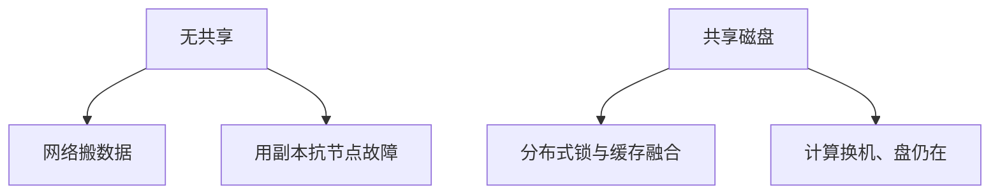

# 无共享对共享存储

无共享：每节点私有盘，扩展靠网络 shuffle。共享磁盘：多节点挂同一存储，扩展靠缓存一致性与锁，故障切换快。

<footer>—— 据 DeWitt and Gray 并行库分类；Stonebraker shared-nothing；Oracle RAC 点名</footer>

[上一课](/cs/db-consistent-hashing)在环上放键。本课不谈令牌。缺口是经典三分法里的两极（共享内存较少作今日主路径）：shared-nothing vs shared-disk。决定故障域、扩展曲线、以及下一课存算能否分离。

## 问题

无共享：MPP、大多数 NewSQL、Postgres 单机+分片中间件。节点挂则其数据要副本才可服务。扩展加机器加盘。共享磁盘：多机可开同一库文件，缓存融合（cache fusion）传页，分布式锁管理器（DLM）代单机 latch+lock 的一部分。缺口是**争用**：共享盘上写同一页要跨机锁，热点差；无共享把热点变成单节点但扩展线性较好。

恢复：共享盘可把计算挂到另一机立刻看到盘（要锁与缓存重建）；无共享要副本升主。

DeWitt and Gray CACM 并行数据库。Stonebraker 主张 shared-nothing。RAC 是共享盘代表。本课分类，不选型广告。

## 方法

分析 MPP 常无共享+shuffle。OLTP 集群共享盘图省分片，但要买 DLM。云盘可被多挂，像共享盘，延迟与 IO 隔离是新问题——下一课分离。

分片键在无共享是必须；共享盘可先不分片。

## 机制

代价模型：无共享连接计网络；共享盘计跨机页运。2Q 在共享盘要考虑被别的节点偷页。WAL：共享盘上日志设备也共享，组提交争用。

一致性哈希落在无共享上自然；共享盘用哈希分区仍可，但是可选。

## 边界

本课不讲存算分离的对象存储。也不把无共享当「无状态」。HTAP 可能一侧无共享列存。

后课默认：MPP 无共享；传统集群共享盘存在。存算分离：计算无状态、存储多租户服务化。

分类决定故障时搬计算还是搬数据。

## 小结

- 无共享扩盘与计算绑定，靠副本；共享盘换计算快、写争用高。
- 连接与锁的代价项因此不同。
- 存算分离下一课。
- 出处：DeWitt and Gray；Stonebraker；RAC 实践。
