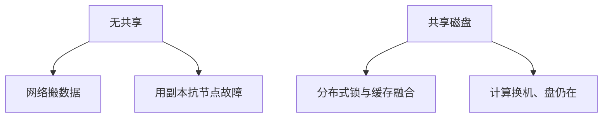
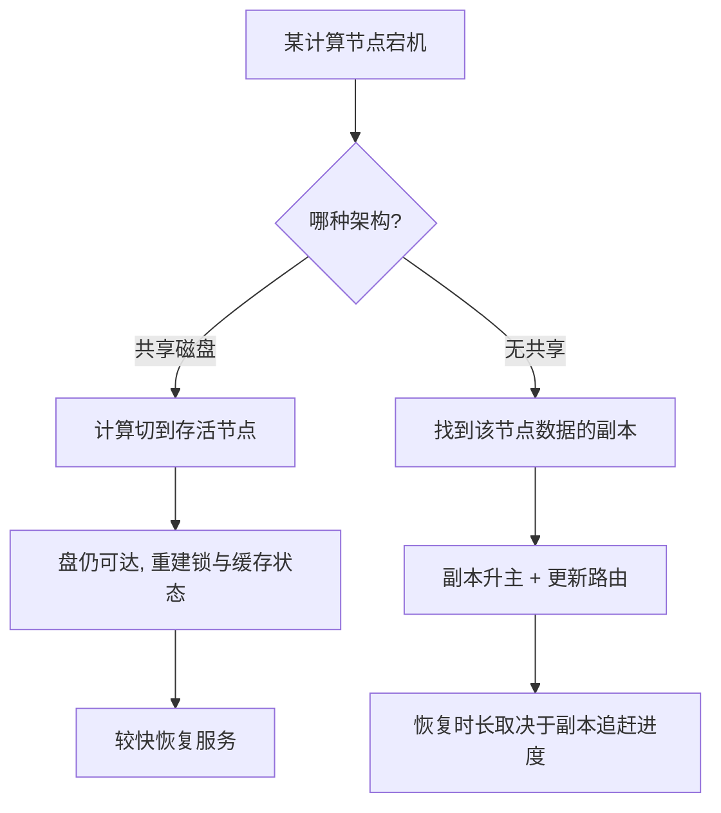

# 无共享对共享存储

无共享：每节点私有盘，扩展靠网络 shuffle。共享磁盘：多节点挂同一存储，扩展靠缓存一致性与锁，故障切换快。

<footer>—— 据 DeWitt and Gray 并行库分类；Stonebraker shared-nothing；Oracle RAC 点名</footer>

[上一课](/cs/db-consistent-hashing)在环上放键。本课不谈令牌。缺口是经典三分法里的两极（共享内存较少作今日主路径）：shared-nothing vs shared-disk。决定故障域、扩展曲线、以及下一课存算能否分离。

## 问题

无共享：MPP、大多数 NewSQL、Postgres 单机+分片中间件。节点挂则其数据要副本才可服务。扩展加机器加盘。共享磁盘：多机可开同一库文件，缓存融合（cache fusion）传页，分布式锁管理器（DLM）代单机 latch+lock 的一部分。缺口是**争用**：共享盘上写同一页要跨机锁，热点差；无共享把热点变成单节点但扩展线性较好。

恢复：共享盘可把计算挂到另一机立刻看到盘（要锁与缓存重建）；无共享要副本升主。

DeWitt and Gray CACM 并行数据库。Stonebraker 主张 shared-nothing。RAC 是共享盘代表。本课分类，不选型广告。

直觉类比：无共享像每个店员有自己锁着的收银抽屉——账目清楚、互不干扰，但店员请假得交接钥匙（副本升主）；共享磁盘像全店共用一台收银机——换人顶班极快，可两人同时找零就得排队拿锁（DLM），高峰期队伍反而更长。

## 方法

分析 MPP 常无共享+shuffle。OLTP 集群共享盘图省分片，但要买 DLM。云盘可被多挂，像共享盘，延迟与 IO 隔离是新问题——下一课分离。

分片键在无共享是必须；共享盘可先不分片。

```mermaid
flowchart TD
  SN["无共享"] --> NET["网络搬数据"]
  SN --> REP["用副本抗节点故障"]
  SD["共享磁盘"] --> DLM["分布式锁与缓存融合"]
  SD --> FAIL["计算换机、盘仍在"]
```

## 机制

代价模型：无共享连接计网络；共享盘计跨机页运。2Q 在共享盘要考虑被别的节点偷页。WAL：共享盘上日志设备也共享，组提交争用。

一致性哈希落在无共享上自然；共享盘用哈希分区仍可，但是可选。

```mermaid
flowchart TD
  N["某计算节点宕机"] --> Q{"哪种架构?"}
  Q -->|共享磁盘| F["计算切到存活节点"]
  F --> F2["盘仍可达, 重建锁与缓存状态"]
  F2 --> UP["较快恢复服务"]
  Q -->|无共享| R["找到该节点数据的副本"]
  R --> R2["副本升主 + 更新路由"]
  R2 --> UP2["恢复时长取决于副本追赶进度"]
```

数字实例：共享盘上两个节点抢写同一热点页，每次都要跨机拿页锁、走 cache fusion 传页版本——一次跨机往返在数据中心内也要几十到上百微秒；无共享架构里这页只有主节点写，没有跨机协调，代价是热点收敛在单节点上。

## 边界

本课不讲存算分离的对象存储。也不把无共享当「无状态」。HTAP 可能一侧无共享列存。

后课默认：MPP 无共享；传统集群共享盘存在。存算分离：计算无状态、存储多租户服务化。

分类决定故障时搬计算还是搬数据。

常见误区：初学者容易把「无共享」读成「无状态」。恰恰相反——每个节点持有一份私有数据加副本，状态最重；无状态的是下一课存算分离里的计算层。nothing 指的是「不共享磁盘」，不是「什么都不共享」。

## 小结

- 无共享扩盘与计算绑定，靠副本；共享盘换计算快、写争用高。
- 连接与锁的代价项因此不同。
- 存算分离下一课。
- 出处：DeWitt and Gray；Stonebraker；RAC 实践。
