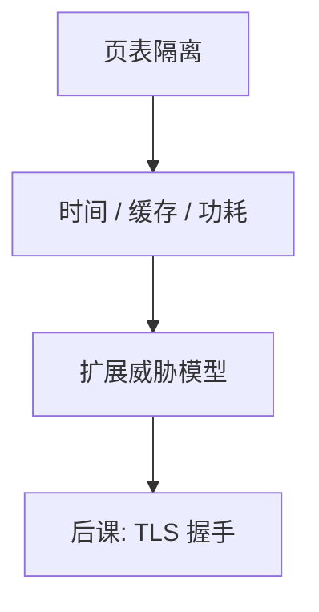

# 侧信道直觉

规格上的隔离保证的是状态与系统调用；时间、缓存、功耗仍可能把密钥变成可测的差异。

<footer>—— 据 Kocher 对计时；Anderson 对侧信道作为威胁模型扩展的整理</footer>

[上一课](/cs/isolation-sandbox)把不可信代码关进盒子。本课不重列容器机制。缺口是：威胁模型若只写「读不了别人的页」，会漏掉**非规格输出**：运行时间、缓存命中、分支预测、电磁。它们不破坏 2PC，也不需要越界写，就能伤害 CIA 的 C。

## 问题

密码实现若按密钥位走不同时间或不同缓存线，观察者即使不能读内存，也能推断位。[特权级](/cs/privilege-rings)与页表不把这些当成通道。缺口不是提供测量与还原密钥的步骤，而是把侧信道标进模型：共享 CPU 的租户、本机恶意进程、甚至远程可测延迟。防御是常数时间实现、隔离共享资源、降低分辨率，而不是再加一把 ACL。

本课不描述具体微结构攻击的操作序列，不给实验配方。只需：逻辑正确的 AES 仍可能在时间上泄漏；对抗要改实现与调度，不只改密钥长度。

## 方法

把「允许观察什么」写进[威胁模型](/cs/threat-model)。实现层：无密钥依赖的分支与访存（常数时间密码）。系统层：关超线程共用、刷新、分区缓存、减少计时器精度。协议层：避免根据秘密走明显不同的往返次数。本课不宣称某一层单独够用。

## 机制

侧信道把「盒子」从逻辑集合变成物理共享。云上多租户使远程计时也进入模型。与缓冲区溢出对照：那是完整性破坏控制流；这里往往是保密失败而控制流仍「正确」。因此测试功能正确不够，还要测实现是否密钥无关。

共享末级缓存把「不同进程」重新连成可测通道，逻辑页表看不见。调度与关超线程是系统层补丁，不是 ACL。

## 边界

不要把本课写成硬件漏洞利用教程。也不要把所有性能抖动都叫侧信道：必须有与秘密相关的差异。物理接触下的功耗、探针是另一类实验室模型，主干只要求意识到存在。

远程计时的分辨率低于本机缓存探测，威胁模型要写清观察者位置。后课默认：即使沙箱正确，密钥操作仍应常数时间；网络上的保密会话要在 TLS 握手里绑密钥，而不是只靠「对方在盒子外」。

实现「功能测试通过」不够。密钥相关的时间差是规格外的输出，必须单独列入测试与代码审查的对象。

## 小结
- 后课默认：密钥操作按常数时间写，TLS 不管端点缓存。
- 常数时间是实现约束：分支与访存不得依赖秘密。本课不给测量还原步骤。
- 后课 TLS 在链路上绑会话键，仍不管端点微结构。

- 沙箱管逻辑边界；侧信道把时间与微结构标进威胁模型。
- 防御：常数时间、资源隔离、降分辨率。
- 开放网上如何协商并认证会话键，是 TLS 握手课。
- 出处：Kocher, 1996（计时作为一类通道的名字）；Anderson, *Security Engineering*。
