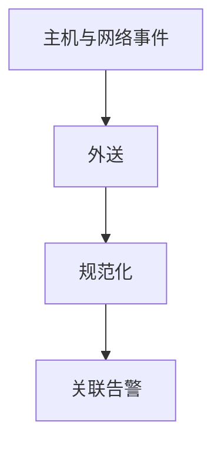

# SIEM

安全信息和事件管理把日志汇聚、规范化、关联。没有可靠时间与身份字段，关联是噪音。日志完整性本身要防篡改，否则根kit 课的撒谎会延伸到记录。

<footer>—— 据 NIST SP 800-92；对照可观测性课的三支柱只作点名</footer>

## 定位

上一课[默认加固](/cs/default-config-hardening)要能证明改过。缺口是**把证据送走并关联**。本课讲日志合同：时钟、身份、外送、保留。不写如何擦日志的步骤。

后课默认已经读完本课钉下的合同，只补差，不从该领域第一性原理重开。

## 问题

主机本地日志可被改。外送到只增存储。缺口是字段：谁、何时、何客体、成功失败。关联规则误报与 IDS 同类。

### 隐私

日志含个人数据，后课 GDPR 会回来。最小化字段。

SP 800-92。禁止日志伪造/擦除教程。事件响应下一课用这些证据。

## 方法

列必须事件：认证、授权失败、管理、出站。下一课事件响应生命周期。

图中节点是本课的机制骨架；课程不把图展开成可运行的攻击步骤。

## 机制

观测是响应的输入。时间不同步则因果链断。IR 下一课是流程。

前提写进合同之后，游戏外的误用只当失败模式点名，不在本课写成操作程序。

## 边界

不写清日志。事件响应下一课。

## 小结

- 加固要证据；SIEM 收证据。
- 外送与只增防篡改。
- 字段与时钟决定关联能否成立。
- 下一课事件响应。
- 出处：NIST SP 800-92。
