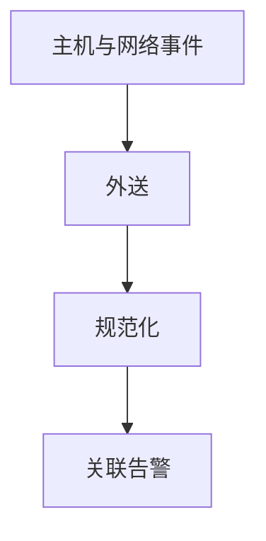
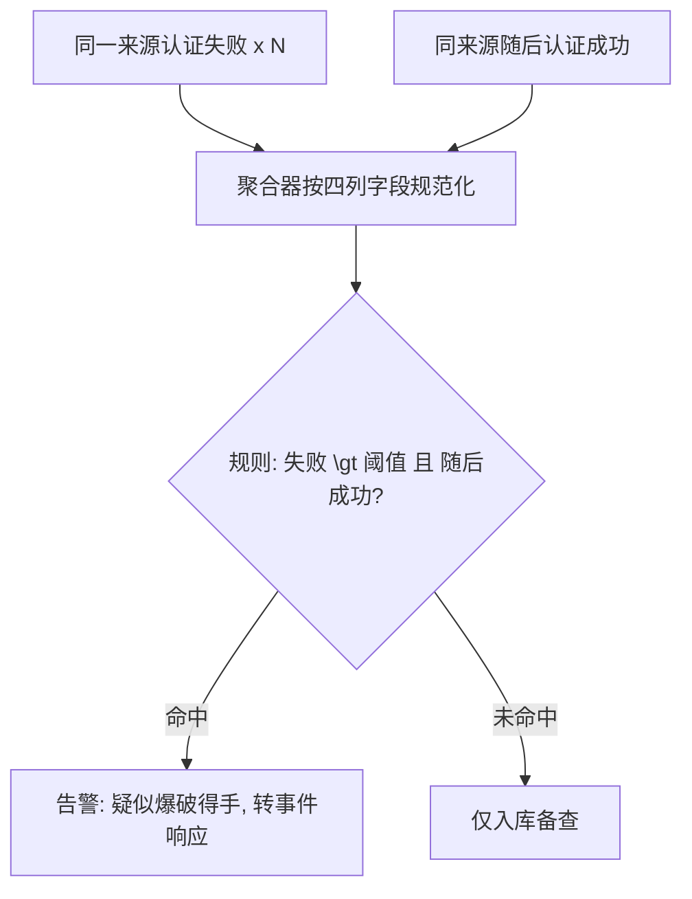

# SIEM

安全信息和事件管理把日志汇聚、规范化、关联。没有可靠时间与身份字段，关联是噪音。日志完整性本身要防篡改，否则根kit 课的撒谎会延伸到记录。

<footer>—— 据 NIST SP 800-92；对照可观测性课的三支柱只作点名</footer>

上一课[默认加固](/cs/default-config-hardening)要能证明配置改过，证明材料就是日志。缺口是**把证据送走并关联**。本课讲日志合同：时钟、身份、外送、保留。不写如何擦日志的步骤。

后课默认已经读完本课钉下的合同，只补差，不从该领域第一性原理重开。

## 问题

主机本地日志在敌手拿下主机后可随手改写——rootkit 课的「撒谎」同样适用于日志文件。第一原则因此是外送：生成即发往聚合器、落只增存储，本地副本被清远端证据仍在。外送之后才谈得上关联，而关联的原料是字段：谁、何时、对何客体、成功失败——缺一列，规则就退化成「某 IP 失败次数多」这类既误报又漏报的东西。关联规则的误报经济学与 IDS 同类：阈值低则告警被忽略，高则真爆破漏过。

### 隐私

日志天然含个人数据：谁在何时登录、访问了什么，GDPR 课会回来算这笔账。设计时最小化字段，保留期写进合同。

数字实例：保留期要按事件类型写进合同——如「认证日志留 90 天、管理面操作留 1 年」。现实里入侵往往在发生后数月才被发现，响应时需要回放到三个月前的初始入口；日志总是比事件响应更早被需要，而不是相反。

SP 800-92。禁止日志伪造/擦除教程。事件响应下一课用这些证据。

## 方法

最小事件集四类：认证成功与失败（爆破在此现形）、授权失败（越权尝试）、管理面操作（改配置、建账号）、出站连接（外送通道）。每类带齐四列字段，并单独验证时钟——NTP 不同步的机器拼不出因果序列。下一课事件响应生命周期。

直觉类比：关联规则像串珠成链——单条日志是一颗珠子（「张三登录成功」本身无善恶），按时间与身份串起来才成项链：「张三凌晨从陌生 IP 登录、五分钟后建了新管理员、随即导出数据库」，三颗珠子连起来才构成告警。

```mermaid
flowchart TD
  SRC["主机与网络事件"] --> SHIP["外送"]
  SHIP --> NORM["规范化"]
  NORM --> CORR["关联告警"]
```

## 机制

SIEM 在栈里的位置是「观测」：它不挡任何攻击，产出的是「发生了什么」的有序序列，供下一课响应流程消费。时间的地位要单独钉：关联在时间轴上进行，两台时钟差几分钟的机器之间连因果方向都可能颠倒——所以时钟与身份是日志合同的前提条款，不是可选优化。观测是响应的输入，IR 下一课是流程。

```mermaid
flowchart TD
  E1["同一来源认证失败 x N"] --> AGG["聚合器按四列字段规范化"]
  E2["同来源随后认证成功"] --> AGG
  AGG --> R{"规则: 失败 \gt 阈值 且 随后成功?"}
  R -->|命中| ALERT["告警: 疑似爆破得手, 转事件响应"]
  R -->|未命中| LOG["仅入库备查"]
```

常见误区：初学者容易以为日志「存下来」就等于安全。敌手拿下主机后的标准动作之一就是清本地日志——只有「生成即外送 + 只增存储」能让擦除失效。还要记住 SIEM 不挡攻击，它挡的是「事后赖账」。

## 边界

不写清除或伪造日志的内容——那正是本课要防的失败模式。事件响应下一课。

## 小结

- 加固要证据；SIEM 收证据。
- 外送与只增防篡改。
- 字段与时钟决定关联能否成立。
- 下一课事件响应。
- 出处：NIST SP 800-92。
