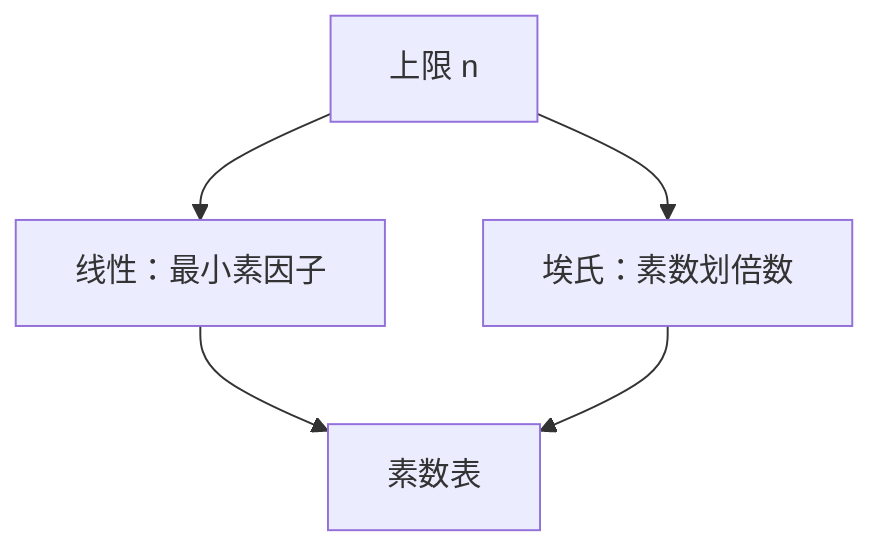

# 素数筛

埃氏筛用每个素数划掉倍数，$O(n\log\log n)$ 列出 $[1,n]$ 的素数；线性筛让每个合数只被最小素因子划一次。

<footer>—— 据 Eratosthenes（古典）；线性筛见现代数论算法教材；CLRS 第 31 章整理</footer>

上一课[内点法](/cs/interior-point)收束连续优化。主干[素性](/cs/miller-rabin)测单个 $n$。缺口是**区间内全体素数**：筛。不重写 Miller–Rabin。后课欧拉函数在筛的数组上填。接[素数生成](/cs/prime-generation)只当密码侧单个大素数，本课是小 $n$ 表。

## 问题

埃氏：从 $2$ 到 $\sqrt n$，是素数则划 $p^2,p^2+p,\ldots$。时间 $\sum_{p\le n}n/p=\Theta(n\log\log n)$。空间 $O(n)$。线性筛（Euler）：维护最小素因子，对每个 $i$ 乘尚未超过 $minp[i]$ 的素数，合数只被最小 $p$ 划到，真正 $O(n)$。

分段筛：内存放不下 $[1,n]$ 时按块筛，空间 $O(\sqrt n+\text{块})$。

缺口是列表，不是单次素性测试。

### 筛不是因式分解

筛给小素数表。分解大 $n$ 是后课 Pollard rho。不要用埃氏筛分解 256 位整数。

CLRS 31 谈数论算法，筛是预备。线性筛同时可积性函数。后课 $\varphi$、$\mu$ 就地筛出。

## 方法

布尔数组或比特压。埃氏或线性。需要 $10^7$ 内表时线性筛顺便 `minp`。更大 $n$ 分段。

偶数可压掉一半。

## 机制

每个合数有素因子 $\le\sqrt n$，故埃氏正确。线性筛的不变量：合数 $i\cdot p$ 在 $p=minp[i\cdot p]$ 时首次标记。与快速幂无关：这里没有模幂。

## 边界

本课不写 Atkin 筛细节。不写素数定理证明。后课默认：$n\le 10^7$ 级用线性筛表。下一课欧拉函数与莫比乌斯。

## 小结

- 埃氏 $O(n\log\log n)$；线性筛 $O(n)$。
- 输出 $[1,n]$ 素数，不是大数分解。
- 分段筛换空间。
- 出处：古典埃氏筛；CLRS 第 31 章。
