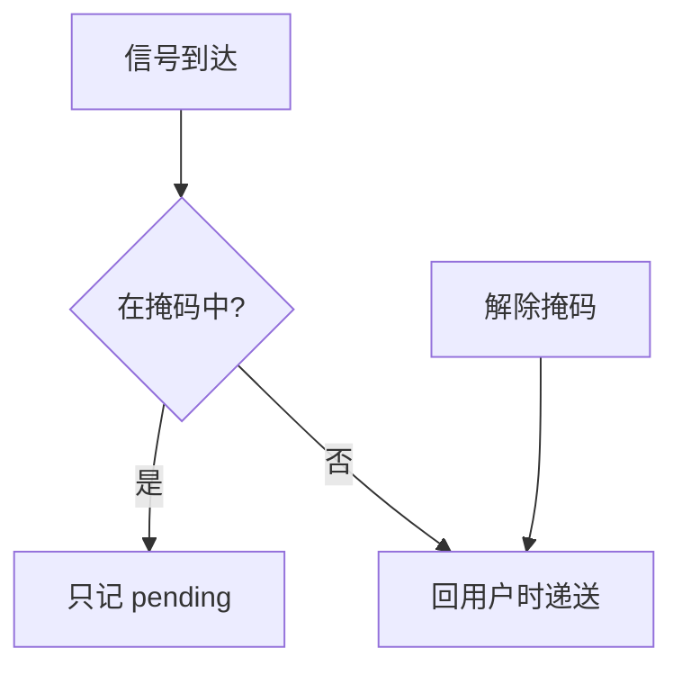
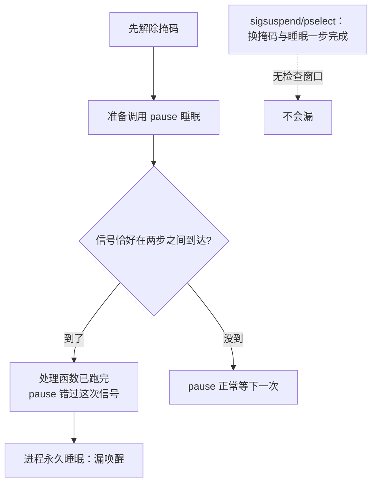

# 信号掩码

进程或线程可以暂时阻塞某些信号：pending 仍记下，直到解除掩码才在返回用户态时递送。

<footer>—— 据 POSIX sigprocmask / pthread_sigmask；Stevens and Rago, APUE 整理</footer>

[上一课](/cs/signals)规定信号在回用户前递送，并点到阻塞集合。缺口是把 **掩码** 收成接口：何时必须挡住、与系统调用重启的关系、以及多线程下「谁的掩码」。不是再列默认动作。下一课管道才传字节。

## 问题

处理函数里若再来同一信号，可能重入不可重入库。临界区若被 `SIGALRM` 打断，用户锁会乱。[锁](/cs/lock-irq) 在用户态不能关中断。缺口：`sigprocmask` 把集合加入 blocked；到达的被挡信号进 pending。`sigsuspend` 原子地换掩码并睡眠。`SA_RESTART` 让部分系统调用在被中断后自动再执行，否则返回 EINTR。

本课不把实时信号排队深度的全部 POSIX 条款背完。

多线程：掩码通常是线程属性；未阻塞的信号递送到某个未挡它的线程。`SIGKILL`/`SIGSTOP` 不能掩。本课不写如何用信号打探内核。

术语翻译：「掩码」就是给本线程设一张信号黑名单——名单上的信号来了不处理，只在 pending 位图里登记一笔，等名单移走它才被递送。它是「推迟」，不是「丢弃」。

常见误区：初学者以为阻塞是把信号扔掉。实际上 pending 那一位仍会亮；而且普通信号同一编号只记一次——挡住期间来了 5 个 `SIGINT`，解除后通常只递送 1 次，实时信号才排队。

## 方法

内核在 PCB/thread 里存 blocked 与 pending 位图。递送条件：pending 有、blocked 无、且到了用户边界。同步信号（如坏地址）通常不可当普通掩码永远吞掉——否则无法前进；实现上仍可能在极短窗口阻塞。`pselect`/`ppoll` 把「等 fd 与换掩码」做成原子，避免漏唤醒，后课多路复用会用到。

```mermaid
flowchart TD
  ARR["信号到达"] --> BLK{"在掩码中?"}
  BLK -->|是| PEND["只记 pending"]
  BLK -->|否| DELIV["回用户时递送"]
  UNMASK["解除掩码"] --> DELIV
```

## 机制

掩码把信号从「随时插入」改成「可推迟的边沿」，让用户态临界区有边界。它不代替管道：pending 几乎不带负载。与内核关中断对照：对象是进程事件，不是本地 IRQ。EINTR 是系统调用路径与信号的接头，应用程序必须会处理或请求重启。

「换掩码」和「睡等信号」若分成两步会发生什么？`sigsuspend`/`pselect` 存在就是为了堵住这个窗口：

```mermaid
flowchart TD
  A["先解除掩码"] --> B["准备调用 pause 睡眠"]
  B --> C{"信号恰好在两步之间到达?"}
  C -- 到了 --> D["处理函数已跑完<br>pause 错过这次信号"]
  D --> E["进程永久睡眠：漏唤醒"]
  C -- 没到 --> F["pause 正常等下一次"]
  G["sigsuspend/pselect：<br>换掩码与睡眠一步完成"] -.->|"无检查窗口"| H["不会漏"]
```

数字实例：信号到达和 `pause` 返回之间哪怕只有 1 微秒的缝隙，也可能在进程恰好频繁收信号时反复踩中——这不是理论问题，老代码里「先 `sigprocmask(SIG_UNBLOCK)` 再 `pause()`」是经典的死等 bug。

## 边界

本课不引入 signalfd 的全部细节，只承认信号也可变成文件描述符上的可读事件。下一课要用内核缓冲传字节，而不是一位 pending。

后课默认：信号可阻塞与推迟。亲缘进程之间的字节流，下一课管道与 IPC。

## 小结

- blocked 推迟递送；pending 仍保留。
- EINTR 与 SA_RESTART 连接系统调用。
- 字节通道是管道课的缺口。
- 出处：POSIX signals；Stevens and Rago, *APUE*；Tanenbaum *MOS*。
