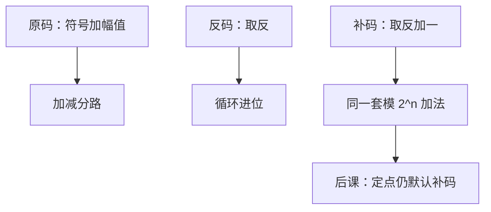

# 符号幅度与反码对照

符号位加幅值最像人写的负数，却逼加法器先看符号；补码把取负做成模 $2^n$ 下加一，才与上一课同一套全加器兼容。

<footer>—— 据 Knuth, The Art of Computer Programming, Vol. 2；Patterson and Hennessy, Computer Organization and Design 整理</footer>

上一课[补码与溢出](/cs/twos-complement)钉死了：最高位负权，减法并进模 $2^n$ 加法，溢出按同号和异号读。本课不重推 $\mathrm{val}(x)$，也不从「负数公理」另起。缺口是：原码、反码仍然出现在文献和浮点符号里，必须对照**为什么默认丢掉它们**，而不是再发明第四种基。

## 问题

人写 $-5$ 是符号加绝对值。原码照搬：最高位 $1$ 表示负，其余位按上一课的无符号幅值读。加法要先比较符号，同号加幅值、异号减幅值，还要处理 $+0$ 与 $-0$。反码按位取反得负数，两个零仍在，$1$ 的进位必须从最高位绕回最低位（循环进位）。缺口因此不是「要不要符号」，而是：哪一种编码让**已经造好的模 $2^n$ 加法器**继续够用。

上一课给出的答案是补码。本课只把另外两条路摆在旁边，钉死后课整数默认补码；[定点与浮点](/cs/fixed-and-float)里 754 的符号位会再走回原码风格，那是后课的缺口。

### 两个零不是「多一个方便」

$+0$ 与 $-0$ 比特不同，比较、哈希、分支都会分叉。补码只有一个零。反码的循环进位是额外数据通路，不是「差不多的加一」。把三种编码当成「都能表示负数，随便选」，后课 ALU 会多出整页例外。

Knuth Vol. 2 §4.1 把符号幅度、反码、补码写成同一位权系统上的三种符号约定。Patterson/Hennessy 直接采用补码，把另外两种留给历史与对照。

## 方法

固定宽度 $n$。原码：$\mathrm{val}=(-1)^s\cdot m$，幅值 $m$ 用 $n-1$ 位无符号。反码：负数是正数按位取反，数值上相当于模 $2^n-1$。补码：取反再加一，即上一课的模 $2^n$。三种都用 $n$ 比特，可表示的整数集合略有不同：原码、反码对称但浪费一个码字给第二份零；补码范围不对称，多一个最负值。

硬件对照到此为止。本课不把浮点的符号–幅度乘指数提前展开。

## 机制

选补码之后，寄存器里的有符号字与无符号字共享加法器，区别只在溢出与比较的读法——上一课已经分开 `blt` 与 `bltu`。原码仍出现在：人读的打印、以及后课 IEEE 754 的符号位。那不是整数 ALU 改回原码，而是另一套编码。混用「最高位是符号」而不说是哪一种，符号扩展会做错。

## 边界

本课不引入饱和算术、不讨论符号–幅度的乘法比补码更省的说法是否值得为加法分路买单。也不把 Gray 码的相邻性套到符号上：负数编码是数值约定，不是枚举次序。

后课默认：有符号整数是补码；谈到原码，只作为对照或浮点符号，不再当整数加法的默认。

## 小结

- 原码像书写法，加法要分符号，且有两个零。
- 反码要循环进位；补码与模 $2^n$ 加法兼容。
- 后课整数默认补码；754 符号是另一套原码风格。
- 出处：Knuth, TAOCP Vol. 2；Patterson and Hennessy, COD。
