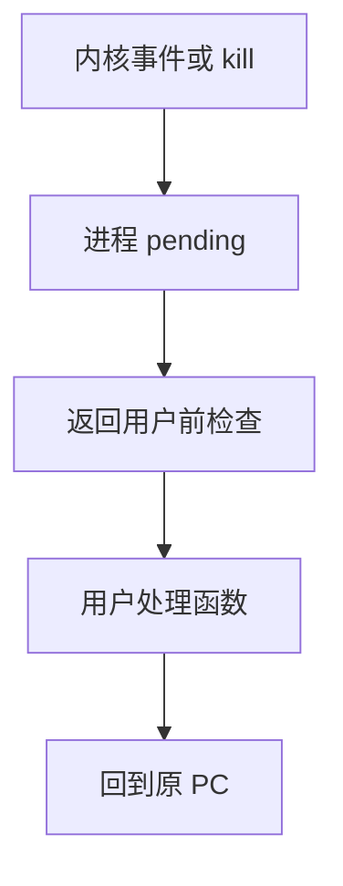

# 信号

信号是通知进程某事件已发生的软件中断；进程可以忽略、捕获或取默认动作。

<footer>—— 据 Stevens and Rago, Advanced Programming in the UNIX Environment；POSIX 对 signal 的整理</footer>

[上一课](/cs/iommu)把期限任务与分时对照完毕。设备 IRQ 走内核下半部；用户线程还缺一种**针对自己的异步通知**：子进程退出、终端键、闹钟、非法内存。缺口不是再调度一次，而是内核向进程投递一种编号事件——信号。

## 问题

若父进程只能 `wait` 轮询，子进程退出的消息会迟到。若用管道专门传「你被中断了」，每个事件都要先建立通道。Unix 把一小类事件做成信号：内核置位，在该进程回到用户态的边界递送。缺口是：执行流在指令边界被拽去处理程序，再回来——像中断，但对象是进程，不是 CPU 向量。

本课不把实时信号排队语义写全，也不把 `sigaction` 的全部标志背完。

默认动作可以是终止、核心转储、停止或忽略。`SIGKILL` 与 `SIGSTOP` 不能捕获，以免进程拒绝被内核回收。

## 方法

内核在 PCB 里记 pending 与 blocked 集合。递送点通常是从内核返回用户之前：若有未阻塞信号，改用户 PC 指向处理函数，并安排返回时回到原指令。处理函数在用户态跑，仍受页表与特权限制；它要再请内核，还走[系统调用路径](/cs/syscall-path)。

进程间也可以 `kill` 投递，这是一种极窄的 IPC，几乎不携带数据。真正传字节是下一课管道。

## 机制

信号把「异步」从设备扩到软件：闹钟到期、管道对端关闭、窗口大小变化，都可以在线程不知情的指令间隙插入。与[中断下半部](/cs/interrupt-bottom-half)的分工：硬件 IRQ 先在内核消化；只有需要该用户进程知情时才置信号。调度仍然决定进程何时跑；信号不代替调度器。

可重入问题：处理函数里调用不可重入库，会与主控制流抢同一用户锁。本课只点名，互斥是后课。

## 边界

本课不把 Windows APC 或 Mach 消息当成同一课对象。不讲信号在多线程里精确递送到哪条线程的全部 POSIX 规则，只承认：信号是进程级事件，线程可以有掩码。也不把信号当通用 RPC。

后课默认：进程可以被编号事件打断。要传的是字节流而不是一位事件，下一课用管道与 IPC。

## 小结

- 信号是指向进程的软件中断，在回用户态时递送。
- 几乎不带数据；默认动作由内核规定。
- 字节级通信是管道的缺口。
- 出处：Stevens and Rago, *APUE*；Silberschatz et al., *OSC*。
