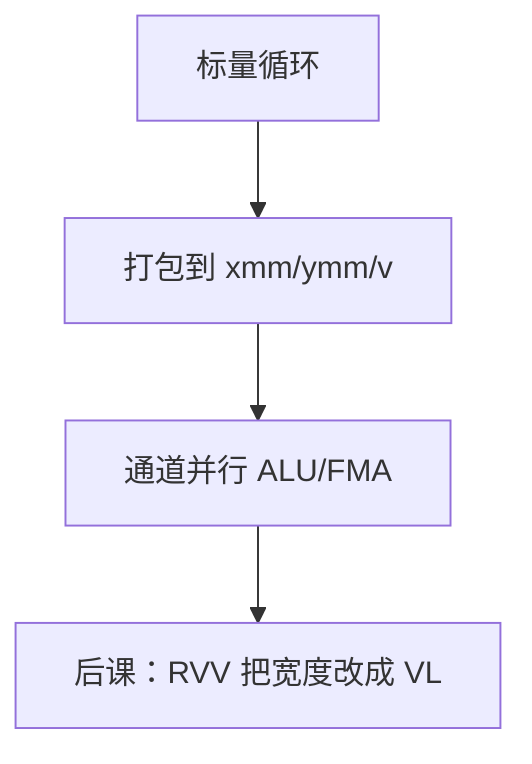

# SIMD 扩展：SSE / AVX / NEON

  
定宽向量寄存器让一条指令打多个通道：x86 从 128 位 SSE 到 256/512 位 AVX，ARM 用 NEON；控制流仍付一次，数据要排齐。

  <footer>—— 据 Intel SDM；ARM ARM；Hennessy and Patterson, CA:AQA；Flynn, IEEE TC 1972 整理</footer>

[上一课](/cs/fence-instructions)管标量可见性。体系结构课[SIMD 与向量](/cs/simd-vector)已给 DLP 原则。缺口是 **ISA 扩展名**：SSE/AVX 与 NEON 的寄存器与打包算术，接到上一单元的 [FMA](/cs/fp-mul-fma) 与[饱和](/cs/saturating-arith)，而不是重写 Flynn 分类。

## 问题

标量 ISA 循环处理 4 个 float 要四条加。SSE：`xmm` 128 位 4×float；AVX：`ymm` 8×；AVX-512：`zmm` 与掩码。NEON：`v` 寄存器 128 位。缺口不是「什么是 SIMD」，而是这些扩展如何编码（x86 前缀/VEX/EVEX，ARM 在 A64 里）以及对齐要求（后课 alignment 会收）。

打包整数饱和乘加对应 DSP 课的端点 MUX，只是铺 $W$ 路。浮点通道遵守 754，异常如何折叠到 MXCSR/FPSR 是实现细节，点名。

### SIMD 不是 GPU SIMT、也不是大模型课

SIMT 多线程束；本课是单线程向量寄存器。不把张量核、注意力算子写进 CS 栏。把 AVX 当「训练加速器产品」，对照课失焦。

Intel SDM 卷 1/2 SIMD 章；ARM NEON。CA:AQA 数据级并行。Flynn 1972 分类名。RVV 下一课才是可变 VL。

## 方法

编译器自动向量化或内建函数。调用约定：SysV/AAPCS 如何传向量寄存器——ABI 课。上下文切换要保存宽寄存器，[FPU lazy](/cs/fpu-lazy) 同类问题放大。内存：连续 load 最快；gather 是 AVX2/AVX-512/SVE 后加，回到不规则。

与 x86 微码：宽指令可能多 μop 或走专用端口。

## 机制

下一课 RVV 用 `vl` 动态长度，避免 AVX 的 128/256/512 分代。压缩指令课与 SIMD 正交。本课把工业定宽 SIMD 钉在 ISA 对照轴上。

## 边界

本课不列全部助记符，不写 AVX-512 许可证政治。不把图像卷积当作业。不进入量化金融向量定价。

后课默认：SSE/AVX/NEON 是定宽打包 SIMD；FMA 与饱和在通道上重复。

## 小结

- 定宽寄存器打包多元素；编码因 x86/ARM 而异。
- 接 FMA 与饱和 ALU，不接 SIMT。
- 下一课 RISC-V 向量改可变 VL。
- 出处：Intel SDM；ARM ARM；Hennessy and Patterson, CA:AQA；Flynn 1972。
