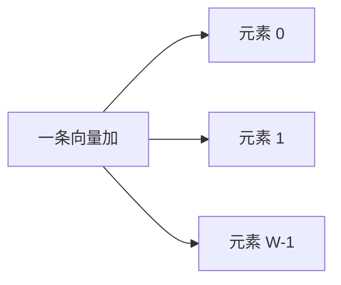

# SIMD 与向量

同一条指令作用在一排数据上，控制流只付一次，数据级并行才不跟 ILP 抢保留站。

<footer>—— 据 Flynn, Some Computer Organizations and Their Effectiveness, IEEE TC 1972；Hennessy and Patterson, CA:AQA 整理</footer>

[上一课](/cs/smt)用标签把单核 ILP 吃到窗口和 CDB 的上限。独立加法很多时，超标量仍要每条指令各占 ROB 项、各占译码带宽。[CPI 与阿姆达尔](/cs/cpi-amdahl)已经警告：只加宽发射，串行控制部分封顶。本课不重讲保留站。缺口是：**数据规则排列时，不必为每个元素取一条指令**。本课只钉 SIMD/向量：一条指令、多条数据通路。

## 问题

循环 `for i: z[i]=x[i]+y[i]` 在标量 ISA 里是加载、加、存，重复 $n$ 次。Tomasulo 可以把它们重叠，但指令数仍是 $\Theta(n)$，取指与 ROB 被填满。缺口不是更聪明的唤醒，而是编码：操作码说「加」，操作数是向量寄存器或一段连续内存。

Flynn 的 SIMD 是分类名；向量机（Cray 风格）带向量长度与剥离循环。本课把它们当作同一轴：数据级并行，不把 GPU SIMT 写进主干。

SIMD 不取消局部性：连续向量 load 吃空间局部性；gather 又回到指针追逐。

## 方法

增加向量寄存器，宽度 $W$ 个元素。向量加：对 $W$ 对元素同时（或流水）做标量加。掩码处理循环尾与条件。内存接口按块取，对齐则一次填满一条向量。

编译器把可向量化循环打成这样的指令。控制冒险仍在标量分支上；向量内部尽量无分支。本课不引入乱序向量调度的细节。

## 机制

指令数下降约 $W$ 倍时，取指能量和 ROB 压力下降。阿姆达尔：循环里不能向量化的部分（循环携带相关、稀疏间接）仍按标量 ILP 走。与[局部性原理](/cs/locality-principle)合拍的是单位步长数组；链表下一课程才会成为反例。

SIMD 与超标量正交：核可以既双发射又带向量单元。结构冒险表现为向量寄存器堆端口与访存带宽。一致性仍按 cache 行，不按向量寄存器——寄存器不是共享副本。掩码让短尾循环不必退回纯标量，但仍是同一条向量指令。

## 边界

本课不把「量化」或张量核写进来，也不进入大模型栏的实现。多核把同一向量循环分到多个程序计数器，是下一课线程级并行，不是更宽的 SIMD。

后课默认：规则数组计算可以一条指令覆盖 $W$ 个元素。共享内存多核仍未出场。

## 小结

- ILP 吃窗口；DLP 把 $W$ 个元素收进一条指令。
- 连续布局才吃得上；不规则访问退回标量。
- 多核共享 cache 是下一课的缺口。
- 本课不把 SIMT 或张量核写进主干。
- 出处：Flynn, *IEEE TC*, 1972；Hennessy and Patterson, *CA:AQA* 数据级并行。
