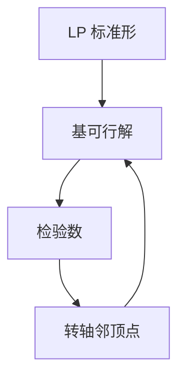

# 单纯形

线性规划的最优在顶点；单纯形沿基可行解走邻边，目标不减，直到检验数都非正。

<footer>—— 据 Dantzig, Linear Programming and Extensions, 1963；CLRS 第 29 章整理</footer>

上一课[高斯消元](/cs/gaussian-elimination-xor-basis)解等式。线性规划（LP）：线性目标 + 线性不等式。缺口是单纯形：基、松弛变量、转轴。不重写消元的 $O(n^3)$ 单次，转轴就是一次消元。后课对偶。Klee–Minty 最坏指数点名。

## 问题

标准形 $\max c^\top x$，$Ax=b$，$x\ge 0$。基 $B$：$A_B$ 可逆，$x_B=A_B^{-1}b\ge 0$，非基为 0。目标用非基变量写，系数（检验数）全 $\le 0$ 则最优。否则选入基，比值检验选出基，转轴。有限顶点，若 degeneracy 须防循环（Bland）。

缺口是顶点游走，不是内点（后课）。多项式界不是单纯形最坏给出的——Khachiyan/Karmarkar 另路。

### 不是整数规划

顶点可以分数。整数约束下一课分支定界。不要把单纯形当 ILP 求解器。

Dantzig 单纯形。CLRS 29。Klee–Minty 1972 指数实例。后课弱对偶、强对偶、互补松弛。

## 方法

引入松弛变标准形。找初始基（两阶段或大 M）。循环转轴直到最优或无界（某列可无限增加）。

实现用表或修正单纯形。

## 机制

可行域多面体，最优可达顶点（有界时）。邻接转轴改一个基列。与最大流：网络单纯形是特例。与高斯：每个基解一次线性方程。目标沿正检验数方向升。

## 边界

本课不写椭球法证明。不写商业求解器预处理。后课默认：LP 顶点最优；单纯形实用、最坏可指数。下一课 LP 对偶。

## 小结

- 最优在顶点；单纯形转轴改基。
- 最坏可指数；实践快。
- 分数解；整数要另法。
- 出处：Dantzig, 1963；CLRS 第 29 章。
