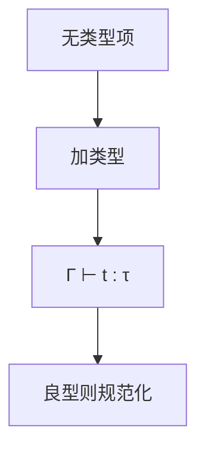

# 简单类型 λ 演算

给无类型项加上函数类型 $\tau\to\tau'$；井型项有范式。类型是静态的过滤器，不是又一套 β。

<footer>—— 据 Church, A Formulation of the Simple Theory of Types, 1940；Pierce, Types and Programming Languages 整理</footer>

上一课[源码编码](/cs/source-encoding-lexing)收束前端课序。主干已有[λ 演算](/cs/lambda-calculus)与[类型检查](/cs/typecheck)。本课是类型系统单元的第一课：缺口不是再定义 β，而是**简单类型**（STLC）——判断 $\Gamma\vdash t:\tau$，以及它相对无类型 λ 失去了什么（不全、没有 `Y`）。后课默认已经读完本课的箭头类型与上下文。

## 问题

无类型 λ 图灵完全，也没有「参数该是函数还是整数」的静态拒绝。[证明助手](/cs/proof-assistants)点过 Curry–Howard，那里要依值；本课先停在简单类型。规则：变量看 Γ，抽象引入 $x:\tau$，应用要求左件是 $\tau\to\tau'$。缺口是**这套判断**，不是词法。

规范化：良型 STLC 强规范化（无类型循环项不可型）。因此 STLC 不是全部可计算——要递归须另加语言结构或后课多态/依值。

### $\to$ 不是机器里的函数指针 ABI

类型是语法对象。擦除后仍可 β。本课不谈闭包转换，那在运行时单元。也不谈 [C 函数类型](/cs/typecheck) 的声明符细节。

Church 1940。Pierce TAPL 第 9 章是本课地图。Appel 用类型保证 IR 的某些不变量。本课不引入积、和、递归类型——后课 ADT 再加。

## 方法

写一小组规则。证明：若 $\Gamma\vdash t:\tau$ 且 $t\to_\beta t'$ 则 $\Gamma\vdash t':\tau$（保持）；良型项可再归约或已是值（进展）——完整定理在[健全性](/cs/type-soundness)课，本课只要规则形状。

与主干类型检查：那里是语言表面语法；这里是核心演算。表面语言的检查应能阐述到 STLC 或其后继。

## 机制

类型擦除：运行不看 $\tau$。简单类型没有多态：恒等函数必须钉死参数类型，或靠后课 HM 的方案。`Y` 无简单类型，故不能在 STLC 里写任意递归。

Church 数字在 STLC 里可型，但足够强的迭代往往需要递归类型或多态。点名即可。

## 边界

本课不写算法 W，不引入子类型。后课默认：箭头类型 + 上下文是核心判断。下一课 Hindley–Milner：从「注解写满」到「主类型」。

不要把 STLC 当 Python 的类型提示；这里拒绝不能型的应用，不是运行时 `TypeError`。

## 小结

- STLC：$\Gamma\vdash t:\tau$，箭头是唯一构造子（本课）。
- 良型项规范化；图灵完全被拿掉。
- 擦除后仍是 λ；类型只在静态。
- 出处：Church, 1940；Pierce, TAPL。
