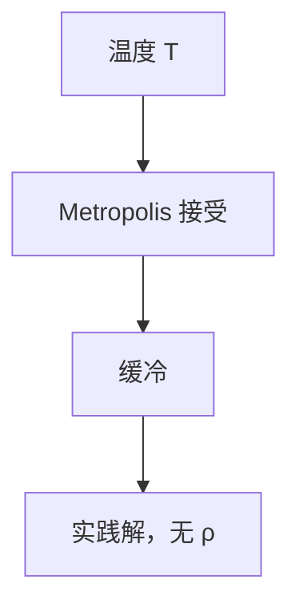

# 模拟退火与元启发

以温度 $T$ 接受变差移动 $\mathrm{e}^{-\Delta/T}$，缓冷趋向低能；元启发无最坏近似比，只有实践与马尔可夫直觉。

<footer>—— 据 Kirkpatrick, Gelatt and Vecchi, Optimization by Simulated Annealing, 1983；Metropolis 等, 1953 整理</footer>

上一课[局部搜索与最大割](/cs/local-search-max-cut)卡在局部最优。模拟退火：差移动也可能走。缺口是 Metropolis 规则与冷却，以及元启发的边界：不替代 2-近似定理。本序列近似在此结束。不写神经网络训练。下一序列模型与下界。

## 问题

状态 $s$，邻域，能量 $E$（如割的负）。$T$ 高：几乎随机游走；$T\to 0$ 成贪心。冷却过快冻在差局部，过慢浪费。没有一般 $\rho$。TSP、布局等实践常用。

缺口是「有保证 vs 无保证」，不是再证 $m/2$。

### 不是物理课相变

Metropolis 来自统计物理。本课优化启发式。不要写配分函数证明全局最优——有限时间没有。

Kirkpatrick 等 1983。Metropolis 1953。遗传算法、禁忌搜索同类元启发，点名。后课 Misra–Gries 换流模型。

## 方法

定义邻域（翻转、2-opt）。几何降温 $T\leftarrow \alpha T$。每温度若干步。多起点。

与局部搜索：$T=0$ 即上一课。

## 机制

平稳分布 $\propto e^{-E/T}$（正则系综直觉）。慢冷若够慢则趋向最优，实践不够慢。与带权随机游走：有限图上的链。与 UCB：bandit 有遗憾界；SA 对组合邻域通常无。

## 边界

本课不写收敛定理的充分条件全文。不把 SA 当 FPTAS。后课默认：要 $\rho$ 用匹配/LP/Christofides；SA 是元启发。下一课流算法 Misra–Gries。

## 小结

- Metropolis 接受差步；缓冷。
- 无一般近似比。
- 与有保证的局部搜索 2-近似分工。
- 出处：Kirkpatrick, Gelatt and Vecchi, 1983；Metropolis 等, 1953。
