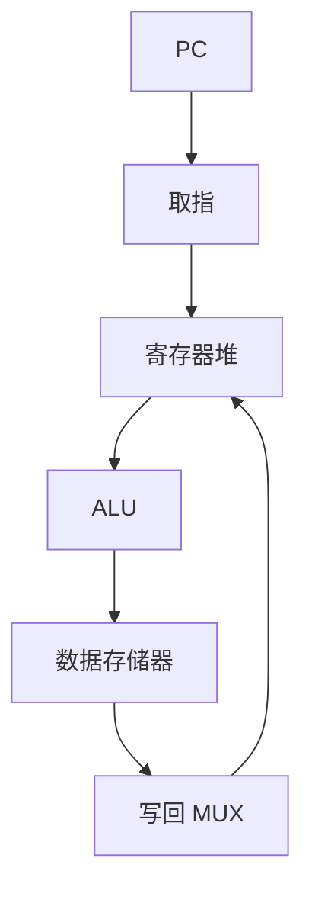

# 单周期数据通路

一条指令在一个时钟周期内走完取指、译码、执行、访存、写回；周期长度等于最长那条路径。

<footer>—— 据 Patterson and Hennessy, Computer Organization and Design (RISC-V) 整理</footer>

上一课[寄存器堆](/cs/register-file)提供了双读单写口。ALU、MUX、内存、PC 计数器此前都已有。本课不重做 6T 单元，也不从流水线五级另起。缺口是：**把积木接成一台能跑 RV32I 子集的机器**，并且规定一拍一条。

## 问题

各块功能已知，还没有一张总图：PC 出地址取指令；指令字段进堆与立即数拼接；ALUSrc 在寄存器与立即数之间选；ALU 算；MemRead/MemWrite 访问数据存储器；MemtoReg 在 ALU 结果与读出数据之间选，写回堆；分支逻辑改 PC。缺口是这条组合路径外加 PC 与堆的边沿更新。

控制信号本课先当输入端口；下一课用真值表驱动它们。

### 单周期不是「延迟槽里的单条」

每条指令一个周期，周期必须盖住最慢指令（通常 `lw`：取指+堆+ALU+数据内存+写回 MUX+$t_{su}$）。`add` 也要等这个 $T$，浪费。这是故意的教学机，用来暴露关键路径；多周期与流水线是后课为修这个浪费。

Patterson/Hennessy 第 4 章先单周期再多周期再流水。指令存储器与数据存储器在图上分开（哈佛口），避免同拍取指又 `lw` 单口冲突。

## 方法

画 PC、指令存储器、堆、立即数扩展、ALU、数据存储器、若干 MUX、分支加法器。时序元件：PC、寄存器堆写、数据存储器写，同一时钟。组合其余。建立保持按[前面的课](/cs/setup-hold)检查最长路径。

## 机制

功能上 RV32I 的核心指令都能走完。性能上 CPI=1，但 $T$ 很大，IPC 的墙钟时间差。后课流水线把同一张图切成多拍重叠；结构冒险来自本课已经分开的指令/数据口是否合并。

`jal` 要把 PC+4 写进 `rd`，数据通路需一条回写 PC+4 的 MUX 输入，容易漏画。

## 边界

本课不实现异常、不实现缓存。数据存储器仍是理想组合读、同步写的教学 SRAM。不把超标量双发射提前。

后课默认：单周期图上的控制线是下一课真值表的输出；硬件在一拍内完成一条指令。

## 小结

- 单周期把取指到写回放进同一 $T$；$T$ 由最慢指令定。
- 积木：PC、双存储器口、堆、ALU、MUX。
- 控制尚未生成；CPI=1 不是最快墙钟。
- 出处：Patterson and Hennessy, COD (RISC-V)。
