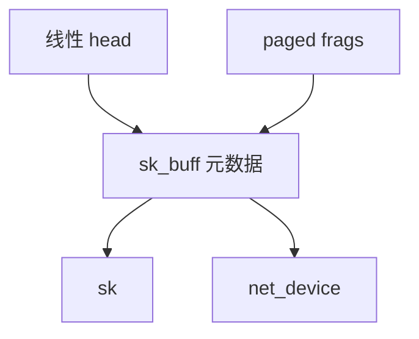

# sk_buff

sk_buff 是内核里一包数据的控制块：头尾指针、分片、校验卸载标志、以及指向套接字与设备的钩子。

<footer>—— 据 Linux networking 文档对 sk_buff 的说明；Stevens 对 mbuf 的对照；Benvenuti, <em>Understanding Linux Network Internals</em></footer>

[上一课](/cs/discard-trim)收口存储。包不是 bio：可变头、要推拉协议层、可能非线性。[sendfile](/cs/sendfile-splice) 已经把页挂出去。缺口是 **sk_buff**：网络栈的统一对象，后课收发路径都围着它转。

## 问题

以太网帧、IP、TCP 头长度不同，还要预留推空间。若每层拷贝，带宽被 CPU 吃掉。sk_buff：线性区 + paged frags（页数组），`skb_push`/`skb_pull` 只动指针。缺口：克隆（`skb_clone` 共享数据、写时拷贝）服务组播与排队；`headroom` 给驱动 DMA 对齐；与 [页缓存](/cs/page-cache) 的关系——sendfile 的页成为 frag，不经过用户。本课不把 eBPF 改包提前写完。

mbuf 是 BSD 亲戚。不要把 skb 当成数据库行：它是包描述符，生命期从驱动到套接字或相反。

## 方法

接收：驱动 DMA 进页，建 skb，把协议指针指向以太网头。发送：套接字分配 skb，协议压头，qdisc 排队，驱动从 frags 做 scatter-gather。释放：引用计数到零还页。对照 bio：bio 是块范围；skb 是字节流上的一段报文，可分片、可 GSO。

## 机制

skb 让各协议层共享同一缓冲而不拷贝，是零拷贝网络的内核侧原语。元数据（hash、checksum status、tstamp）决定后课 GRO/GSO 能否卸载。不要写成量化行情包格式。与 cgroup：skb 可打 classid，但会计在后课。

错误路径：drop 统计在此对象上加，tcpdump 抓的也是它的镜像。

实现上：clone 只拷控制块，写头时才 pskb_expand_head。GSO 包的 gso_size 让协议层把一包当多段。释放路径必须处理分片页的引用，否则页缓存钉死。 读法上只引用[上一课](/cs/discard-trim)的结论，不把对象换成训练推理或限价簿。

本课在操作系统进阶的「网络栈 / 收发路径」课序里，对象是 **sk_buff**。

- 先修只引用，不重导：上一课的结论当公理，本课只补差。
- 五栏不吞并：不把本课写成大模型训练/推理，也不写成限价簿或权重量化。
- 文献用 OSTEP、McKusick、内核文档与具名会议论文；不发明 arXiv 编号。

## 边界

本课不引入 skb 扩展（secpath、nfct）的全部指针。不保证用户态包 I/O 用同一结构——DPDK 用 mbuf 自己的。下一课驱动如何把中断收成 napi 轮询：NAPI。

版本字段会变，课序钉的是机制对象「sk_buff」，不是某一主线内核的结构体名。
后课默认：包在内核里是 sk_buff。网卡中断与轮询如何灌 skb，下一课 NAPI。

## 小结

- sk_buff 用指针与分片描述一包，可克隆共享数据。
- 发送接收路径都围绕它，而不是 bio。
- NAPI 是下一课。
- 出处：Linux skb；Benvenuti *ULNI*；Stevens mbuf。
