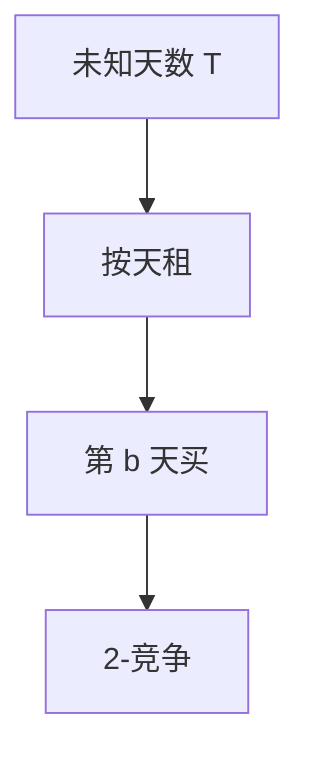

# 租买问题

每天租 1，买断代价 $b$；确定性最优是租 $b-1$ 天再买，2-竞争；随机可到 $e/(e-1)$。

<footer>—— 据 Karlin, Manasse, Rudolph and Sleator, Competitive Snoopy Caching, 1988；租买成为在线教材原型整理</footer>

上一课[页面置换](/cs/paging-competitive)是 $k$-竞争。租买（ski rental）：未知滑雪天数 $T$。缺口是最干净的 2-竞争：阈值购买。不重写 LRU 势。后课秘书是选最大。本课 1-server 式的买 vs 租。

## 问题

离线：若 $T\lt b$ 全租，否则第一天买，代价 $\min(T,b)$。在线不知道 $T$。确定性：某天买。最优确定性：租 $b-1$ 天，第 $b$ 天买，代价 $\le 2\,\mathrm{OPT}$。任何确定性 $\ge 2-O(1/b)$。随机：以几何或调和分布在天数上买，期望 $e/(e-1)\approx 1.58$。

缺口是这一阈值，不是缓存槽。

### 不是金融期权定价

同一「何时沉没成本换所有权」的形状，本课纯竞争比。不写 Black–Scholes。

Karlin 等 1988 与 snoopy caching。教材把 ski-rental 当 2-竞争原型。后课秘书问题。

## 方法

确定性写清阈值。随机：给出分布与期望分析要点（对 oblivious）。自适应对手随机无优势。

买断后代价不再涨。

## 机制

最坏 $T=b$：在线付 $b-1+b=2b-1$，OPT 付 $b$。更长 $T$ 双方都付 $b$ 量级。随机把质量摊在可能的 $T$ 上。与分页：租买是 $k=1$ 的某种极限直觉，不要硬等同。

## 边界

本课不写多件设备、不写利率。后课默认：未知使用时长买 vs 租，确定性 2。下一课秘书问题。

## 小结

- 确定性租 $b-1$ 再买，2-竞争。
- 随机 $e/(e-1)$。
- 离线 $\min(T,b)$。
- 出处：Karlin, Manasse, Rudolph and Sleator, 1988。
