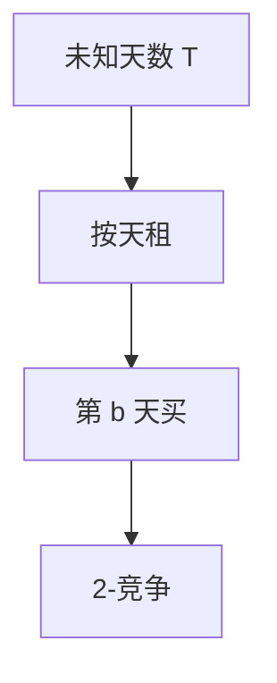

# 租买问题

每天租 1，买断代价 $b$；确定性最优是租 $b-1$ 天再买，2-竞争；随机可到 $e/(e-1)$。

<footer>—— 据 Karlin, Manasse, Rudolph and Sleator, Competitive Snoopy Caching, 1988；租买成为在线教材原型整理</footer>

上一课[页面置换](/cs/paging-competitive)是 $k$-竞争。租买（ski rental）是更小的原型：未知滑雪天数 $T$，每天租 1、买断 $b$。缺口是最干净的 2-竞争：阈值购买。不重写 LRU 势。后课秘书是选最大。本课 1-server 式的买 vs 租。

## 问题

离线知道 $T$：短于 $b$ 全租，否则第一天买，代价 $\min(T,b)$。在线不知道 $T$，只能边租边选买日。确定性最优是阈值策略：租 $b-1$ 天、第 $b$ 天买，总代价 $2b-1$，不超过 $2\,\mathrm{OPT}$；且任何确定性策略都躲不开约 $2-O(1/b)$，所以 2 是确定性极限。随机化可到 $e/(e-1)\approx 1.58$：按几何或调和式分布选买日。

缺口是这一阈值，不是缓存槽。

### 不是金融期权定价

形状与「何时付沉没成本换所有权」同型，但本课纯竞争比，不写 Black–Scholes。

Karlin 等 1988 与 snoopy caching。教材把 ski-rental 当 2-竞争原型。后课秘书问题。

## 方法

确定性方案写清阈值再分段证界：$T\lt b$ 时付 $T\le b-1\lt 2\,\mathrm{OPT}$；$T\ge b$ 时付 $2b-1\le 2\,\mathrm{OPT}$。随机方案要给出买日分布并做期望分析——关键设定是对 oblivious 对手：敌手看不到你的随机数；对手自适应时随机化没有优势。

买断后代价不再涨。

```mermaid
flowchart TD
  DAY["未知天数 T"] --> RENT["按天租"]
  RENT --> BUY["第 b 天买"]
  BUY --> TWO["2-竞争"]
```

买断后代价不再涨。

## 机制

下界看清困难所在：最坏 $T=b$ 时在线付 $b-1+b=2b-1$，OPT 只付 $b$——早买怕短租、晚买怕长租，信息缺口本身值一倍 $b$，确定性 2 竞争因此卡死。$T$ 更长时双方都付 $b$ 量级，比值趋近 1。随机的效果是把概率质量摊到可能的 $T$ 上，任何单一 $T$ 的期望都压在 $1.58\,\mathrm{OPT}$ 内。与分页的关系是同族不是同题：租买可当 $k=1$ 的极限直觉，不要硬等同。

## 边界

本课不写多件设备、不写利率与折现。后课默认：未知使用时长买 vs 租，确定性 2-竞争。下一课秘书问题。

## 小结

- 确定性租 $b-1$ 再买，2-竞争。
- 随机 $e/(e-1)$。
- 离线 $\min(T,b)$。
- 出处：Karlin, Manasse, Rudolph and Sleator, 1988。
