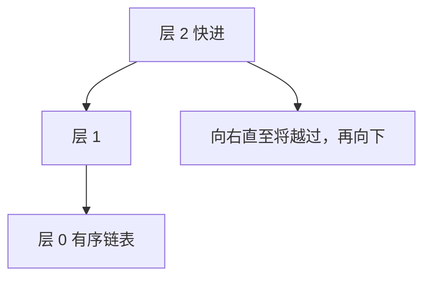

# 跳表

在有序链表上随机加几层快进指针，期望查找变成对数，而不必维护旋转不变式。

<footer>—— 据 Pugh, Skip Lists: A Probabilistic Alternative to Balanced Trees, CACM 1990 整理</footer>

[上一课](/cs/bloom-filter)的散列不保序。[红黑树直觉](/cs/rbtree-intuition)保序但要颜色与旋转。[链表与局部性代价](/cs/linked-list-locality)的有序链表查找是 $\Theta(n)$。本课不重讲探测序列。缺口是：用随机化给链表加「快递层」，期望 $O(\log n)$ 查找/插入/删除，实现比红黑短。最坏仍可退化，合同写期望。

## 问题

有序字典若坚持最坏对数，必须平衡树。若接受期望对数（与随机 BST、散列同类），可以让每个节点以 $1/2$ 概率升高一层，高层是底层的稀疏捷径。缺口不是新的键比较，而是**层高随机、搜索从最高层向右再向下**。

Pugh 1990 把这套结构写成可实用的替代。本课不把并发跳表的 CAS 细节写进来。

期望高度 $O(\log n)$，空间期望 $O(n)$。与 AVL 的确定对数不同，与散列的不保序也不同。

## 方法

底层是有序链表。节点有 $h$ 个前向指针，$h$ 在插入时抛硬币决定。查找：从最高层头节点向右，下一步会超过目标则下一层。插入：先查找记下每层前驱，再抛硬币建节点、接线。删除：同样前驱改指针。

与[摊还分析](/cs/amortized-analysis)不同：这里是概率期望，不是最坏摊还。可以高概率说高度 $O(\log n)$，仍不是 AVL 那种确定界。硬币概率取 $1/2$ 只是常见默认；改成 $1/p$ 只调层数期望，不改对数形态。

## 机制

中序就是底层链表遍历，范围查询自然。散列做不到这一点。旋转代码量为零，正确性主要在接线。局部性仍差：多层指针比数组跳得更散；B 树外存仍赢。内存里跳表常数可接受，且实现短。头节点必须具备最高层指针，否则无法从顶层起步。

## 边界

本课不把跳表写成「永远替代红黑」。实时最坏路径仍可能碰到未升高的长链，尽管概率小。也不引入确定性跳表。字符串前缀共享是另一结构：Trie。

后课默认：有序字典可以树或跳表。按字符前缀压缩路径，用 Trie。

## 小结

- 跳表 = 有序链表 + 随机快进层，期望对数。
- 保序、实现短；最坏与局部性弱于平衡树和 B 树。
- 前缀键的共享路径是下一课 Trie。
- 合同写期望，不写 AVL 那种确定对数。
- 头节点必须具备最高层指针，查找才能从顶层起步。
- 出处：Pugh, *CACM*, 1990。

