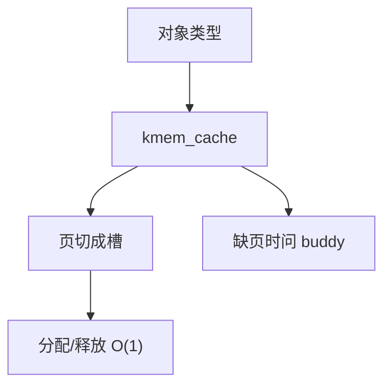

# slab 分配器

同类内核对象从专用缓存里取：一页切成等长槽，构造函数只在首次填充时跑，避免每次从 buddy 要页再初始化。

<footer>—— 据 Bonwick, The Slab Allocator, USENIX 1994；Love 对 SLAB/SLUB 的整理</footer>

[上一课](/cs/buddy-allocator)给出页级块。inode、dentry、页表项描述符大小远小于一页，若每个对象 `alloc_pages(0)`，内碎片与初始化成本爆炸。[VFS](/cs/vfs) 尚未讲，但对象缓存必须先存在。缺口是 **slab**：按类型的对象工厂，建立在 buddy 页之上。

## 问题

内核分配有两个坏极端：全走 buddy（浪费），或一个全局字节堆（碎片与锁）。Bonwick 的方法：每种对象一个 cache，cache 持有若干 slab（一页或几页），slab 内空闲对象链表。分配 O(1) 取槽；释放回本 cache。着色（colouring）错开对象在页内偏移，减轻 Cache 行冲突。缺口不是用户 malloc 算法，而是内核里生命周期相似的对象。

本课不把 SLAB、SLOB、SLUB 三种实现做成对照表考试。

SLUB 简化了每 CPU 的部分数组，减少锁。对象可以有构造/析构。过大的对象仍直接走 buddy。

## 方法

`kmem_cache_create` 登记大小与对齐。`kmem_cache_alloc` 从本 CPU 空闲槽取；没有则向 buddy 要一页填满对象。释放不立即还页，直到整页空闲或回收器收缩。与用户态对照：libc 的 arena 是进程私有；slab 是全核共享（加锁或 per-CPU）。缺页路径上分配的 `anon_vma` 一类对象走这里。

## 机制

slab 把「页」变成「类型化内存」，让 VFS 与网络协议栈的热点分配不再打 buddy 锁。回收时 shrinker 可以丢掉空 slab，把页还给 buddy，再给用户缺页用。不要把 slab 当成安全隔离：同页上的对象仍共享帧，越界写会破坏邻居——这是内核编程纪律，不是本课的利用指南。

## 边界

本课不引入 `kmalloc` 按尺寸的通用 cache 的全部档位表。不保证实时路径无锁。下一课：当 buddy 也空了，谁去收缩 slab、页 Cache 与匿名页。

后课默认：小对象有 cache。内存压力下如何把页从 cache 与文件页里挤出来，下一课回收。

## 小结

- slab 在 buddy 页上为同类对象提供槽位缓存。
- 减少碎片与重复初始化；空 slab 可还给 buddy。
- 压力下的收缩是 shrinker 的缺口。
- 出处：Bonwick, USENIX 1994；Love, *LKD*；Bovet and Cesati, *ULK*。
