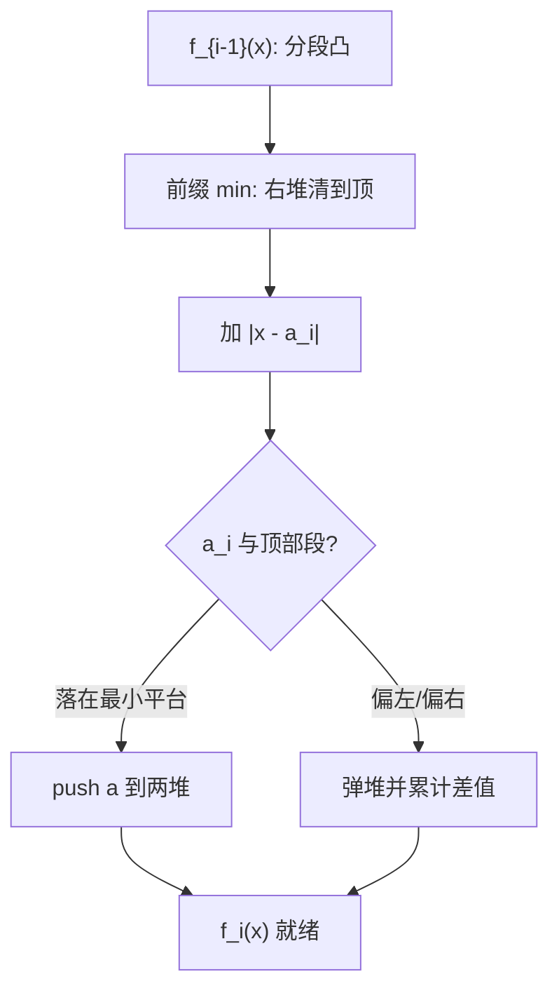
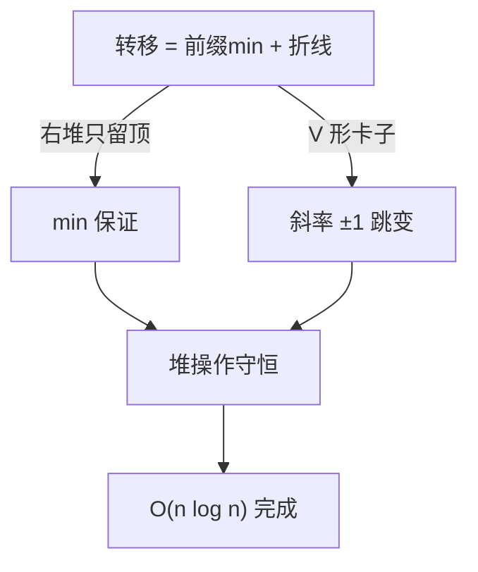

# Slope Trick

DP 的状态函数是分段凸的，就别存函数存斜率：两个堆各抱一头，加绝对值、整体平移都是常数级操作。

<footer>—— 据 competitive programming 中 Slope Trick 技法；Aksenov (2015) 系统化</footer>

[Slope Trick](/cs/slope-trick) 补的是 DP 优化的一个空档：转移里出现 $|x-a|$、$\max(0,\cdot)$ 这类折线时，把整条分段凸函数塞进两个堆里维护，转移从「枚举状态」降为「堆顶增删」。上一课的计数在数方案，本课在算最优值——凸性是共同的靠山。

## 问题

经典母题：序列每步可 $\pm 1$ 或不动，代价为与目标序列差的绝对值之和，求最小代价；或「把数组变成非降序的最少改动」。朴素 DP 状态是「以 $i$ 结尾、末值为 $x$」的函数 $f_i(x)$，$x$ 连续则没法直接存。缺口：**分段凸函数的增量维护**。本课不碰严格凹或高次项——那要换成李超线段树或凸包。

术语翻译：breakpoint（拐点）= 斜率发生变化的 $x$ 坐标；Slope Trick 把「拐点存进堆」当原子操作，函数本身从不显式写出。

数字实例：$f(x)=|x-3|+|x-5|$ 在 $[3,5]$ 上斜率为 0、最小值 0。用堆表示：左堆存 $\{3\}$（斜率 $\lt 0$ 段的拐点）、右堆存 $\{5\}$，再加常数 $-0$。函数存在，数值却只有两个数。

## 方法

三条原子操作覆盖常见转移：加常数（改堆外一个 Lazy 值）；加 $|x-a|$（左堆 push $a$、右堆 push $a$，再弹堆调整答案）；取 $\min$ 后平移（把一侧堆整体清到顶、另一侧保留）。以「非降序列最小 L1 改动」为例：$f_i(x)=\min_{y\le x} f_{i-1}(y)+|x-a_i|$，先对 $f_{i-1}$ 做前缀 min（右堆只留顶），再加 $|x-a_i|$。

直觉类比：左堆是「下坡的坡顶档案」，右堆是「上坡的坡底档案」，中间永远是一段平地（最优区间的全体 $x$）。加 $|x-a|$ 相当于在 $a$ 处放一个 V 形卡子：卡子若落在平台内，$a$ 同时成为左右档案的新条目；落在坡上，就把原来的条目挤出去一层。

## 机制

正确性系于一条守恒律：分段凸函数的斜率序列，左段斜率非增、右段非减，堆内元素按「每个拐点贡献一单位斜率」编码。前缀 min 只可能削平右侧，故右堆保留最小拐点即可；加 $|x-a|$ 让斜率整体 $-1\to+1$ 跳变一次，恰好对应左右各进出堆常数次。每个操作都保持「堆深 = 函数复杂度」，所以总复杂度 $O(n\log n)$。

数字实例：数组 3 5 2 7 变非降。$f_1=|x-3|$，平台 $\{3\}$，min $0$；加 $|x-5|$（5 不在平台左侧）答案 $+0$，$f_2$ 平台 $\{5\}$；加 $|x-2|$（2 在平台左侧）弹右堆顶 5，答案 $+5-2=3$，平台移到 $[3,5]$；加 $|x-7|$（7 在右侧）$+0$。总代价 $3$，最优终点取 $x=7$，目标序列如 3 5 5 7（把 2 改成 5）。

常见误区：把 Slope Trick 当成「堆优化」的万金油——它要求被维护的函数**分段线性且凸**；二次代价 $\lambda(x-a)^2$ 会让斜率连续变化，堆表示直接失效，此时应换凸包或三分。

## 边界

适用信号：转移含绝对值、$\max/\min$、且能证明状态函数凸。不适用：凹代价、多维状态（多维凸即 L♮ 凸，堆表示不够）、需要还原具体方案（要额外存被弹拐点，空间乘 $n$）。与其他优化关系：SMAWK 处理「行最小值位置单调」但函数不必凸；李超树查任意一次函数最值但不做增量合并——Slope Trick 卡在「凸 + 可堆」这个交叉点上。

直觉类比：这像水管工不用整张图纸，只记录两摞弯头清单；每接一根新管（新元素），要么把弯头插进清单，要么顶掉一个旧弯头并记一笔工钱（答案增量）。

## 小结

- 分段凸 DP 函数 = 左右两个堆 + 一个常数，加 $|x-a|$ 与前缀 min 都是均摊 $O(\log n)$。
- 守恒律是「拐点 = 一单位斜率」，堆深即函数复杂度。
- 二次项、凹函数、多维状态都出圈，各有对应工具。
- 出处：Aksenov「Slope Trick」方法笔记 (2015)；CF 题解 conventional 口径；SMAWK: Aggarwal et al. 1987。
