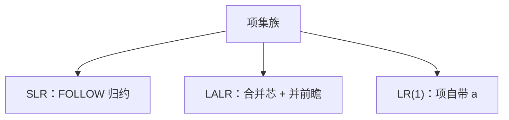

# SLR 与 LALR

同一张项集规范族上，SLR 用 FOLLOW 决定归约，LALR 把 LR(1) 项按芯合并；表更小，认的语言夹在 SLR 与 LR(1) 之间。

<footer>—— 据 DeRemer, Simple LR(k) Grammars, 1971；DeRemer and Pennello, Efficient Computation of LALR(1) Look-Ahead Sets, 1982；龙书第 4 章整理</footer>

上一课[LR 与移进归约](/cs/lr-shift-reduce)给出项、闭包、GOTO、移进/归约冲突，并声明 SLR 用 FOLLOW、LALR 是 Yacc 的实用点，没有填表。本课不重画最右推导。缺口是三种表的差别：SLR(1)、LALR(1)、LR(1)——状态怎么增，冲突怎么少。归约时可挂语义动作，下一课 AST 就在这里接。

## 问题

LR(0) 项不带前瞻，同一状态里两条完成项就会归约/归约冲突。SLR：完成项 $A\to\alpha\cdot$ 只对 $a\in\mathrm{FOLLOW}(A)$ 归约。FOLLOW 是粗前瞻，可能仍冲突。LR(1) 项 $[A\to\alpha\cdot\beta,a]$ 把前瞻钉在项上，状态变多，冲突最少（在确定 CFG 的实用范围内）。LALR：把芯（忽略前瞻的 LR(0) 部分）相同的 LR(1) 状态合并，前瞻取并。状态数约等于 LR(0) 族，前瞻比 SLR 细。

缺口是这层包含：$\mathrm{SLR}\subset\mathrm{LALR}\subset\mathrm{LR}(1)$（能无冲突分析的文法类）。Yacc/bison 默认 LALR(1)。if-else 仍常要 `%left`/`%nonassoc` 人工消二义，LALR 本身并不消去二义。

### 合并可能引入新冲突

两个 LR(1) 状态芯同、前瞻不同，合并后可能在同一完成项上多出一个不该归约的符号。故存在 LALR 冲突而规范 LR(1) 无冲突的文法。本课承认，不构造病态长例。

DeRemer 的 SLR 与 LALR。龙书 4.6–4.7 节比较表大小。Knuth LR($k$) 是上一课总框架。本课要生成器选哪张表，不手填 GOTO 全表。

## 方法

从增广文法建 LR(0) 项集（SLR/LALR 的芯）。SLR：归约栏填 FOLLOW。要 LALR：传播前瞻（DeRemer–Pennello）或先 LR(1) 再合并。冲突仍在则改文法或加优先级。

分析循环与上一课相同：查动作表直到接受。归约 $A\to\alpha$ 时执行用户动作：`new` AST 节点——对象下一课才定义，本课只留挂钩。

## 机制

左递归对三族都友好。表的体积：LR(1) 可能上千态，LALR 几百，够一门课的语言。错误恢复（恐慌模式丢记号）是生成器附加，本课点名。

不要把 FOLLOW 当 FIRST：FOLLOW 管「A 推完后后面能见什么」，归约用它。

## 边界

本课不列出闭包伪代码全文，不处理 GLR。后课默认：实用语法用 LALR/SLR 表驱动；归约动作构造抽象语法树，丢掉分层非终结符。

## 小结

- SLR 用 FOLLOW；LR(1) 项带前瞻；LALR 合并芯。
- 文法类 SLR ⊂ LALR ⊂ LR(1)；Yacc 用 LALR。
- 归约挂钩给下一课 AST。
- 出处：DeRemer, 1971；DeRemer and Pennello, 1982；龙书第 4 章。
