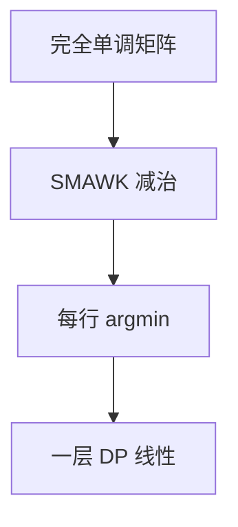

# SMAWK 决策单调

完全单调矩阵每行最小值的列号非降；SMAWK 用减治在 $O(n)$ 次查询内找出所有行最小（列数同类）。

<footer>—— 据 Aggarwal, Klawe, Moran, Shor and Wilber, Geometric Applications of a Matrix-Searching Algorithm, 1987 整理</footer>

上一课[分治优化与四边形不等式](/cs/dc-opt-quadrangle)已用 $opt$ 单调做分治 $O(n\log n)$。更强：矩阵 $A[i,j]=dp[j]+w(j,i)$ 完全单调时，SMAWK 线性求每行 $\arg\min$。缺口是这份减治，不是再证四边形。后课插头 DP 换网格轮廓。

## 问题

矩阵 $M$ 完全单调：对 $a\lt b$，$c\lt d$，若 $M(a,c)\gt M(a,d)$ 则 $M(b,c)\gt M(b,d)$（行最小位置非降的充分结构）。SMAWK：奇偶行减列，递归。查询 $M(i,j)$ 若 $O(1)$，总时间 $O(n)$（$n\times n$）。

DP 一层：$dp'[i]=\min_j dp[j]+w(j,i)$ 可一次 SMAWK。比分治少 $\log$。

### 不是任意单调队列

完全单调强于「每行最小非降」的使用方式，实现细节多。不会证 $w$ 就不要宣称 SMAWK。实践多分治够用。

Aggarwal 等 1987（作者姓首字母 SMAWK）。后课插头 DP 是另一指数状态，不是矩阵搜索。

## 方法

若 $w$ 使 $M$ 完全单调，调用 SMAWK 得 $opt[i]$，再填 $dp$。实现可先写分治，SMAWK 当加速。

查询复杂度乘进总时间。

## 机制

减列：比较相邻，劣列永不做某奇偶行的最小。递归规模减半。与四边形：四边形常推出完全单调，细节依赖 $w$。与 CHT：CHT 要直线结构，SMAWK 要矩阵单调。

## 边界

本课不手写 SMAWK 全伪代码。不写高维。后课默认：决策单调先分治；完全单调可 SMAWK。下一课插头 DP。

## 小结

- 完全单调 $\Rightarrow$ 行最小线性可求。
- DP 一层可 $O(n)$ 查询级。
- 结构比分治更苛刻。
- 出处：Aggarwal, Klawe, Moran, Shor and Wilber, 1987。
