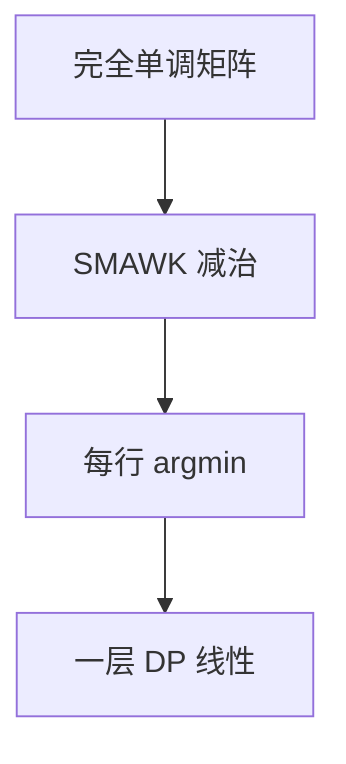
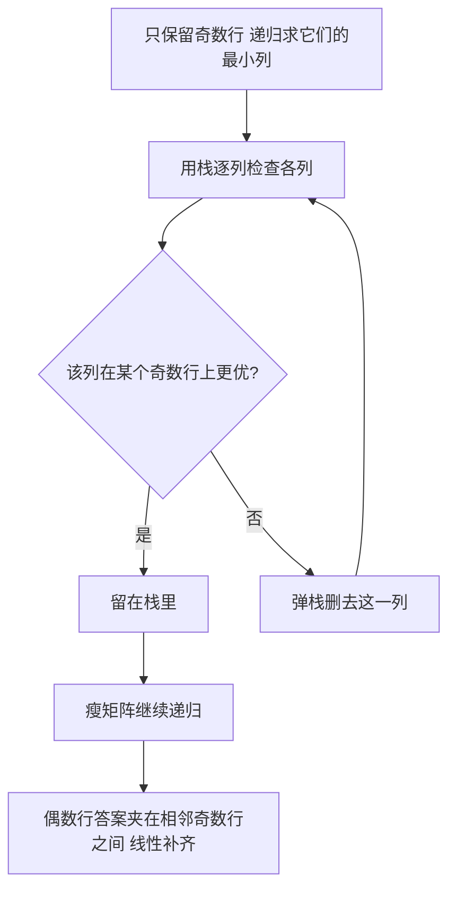

# SMAWK 决策单调

完全单调矩阵每行最小值的列号非降；SMAWK 用减治在 $O(n)$ 次查询内找出所有行最小（列数同类）。

<footer>—— 据 Aggarwal, Klawe, Moran, Shor and Wilber, Geometric Applications of a Matrix-Searching Algorithm, 1987 整理</footer>

上一课[分治优化与四边形不等式](/cs/dc-opt-quadrangle)用 $opt$ 单调做分治，做到 $O(n\log n)$。本课再进一步：当矩阵 $A[i,j]=dp[j]+w(j,i)$ 完全单调时，SMAWK 能以线性次数的查询求出每行的 $\arg\min$。缺口是这份减治怎么工作，不是再证一遍四边形不等式。后课插头 DP 换到网格轮廓线上的指数状态。

## 问题

完全单调的定义：对 $a\lt b$、$c\lt d$，若 $M(a,c)\gt M(a,d)$，则 $M(b,c)\gt M(b,d)$——上一行里 $d$ 列已经更好，更靠下的行 $d$ 只会更好，行最小位置因此非降。SMAWK 的减治：只保留奇数行，在更小的矩阵上递归求出它们的最小列；先比较并删去不可能成为任何奇数行最小的「劣列」，列数随之减少，再把偶数行的答案夹在相邻奇数行答案之间线性补齐。查询 $M(i,j)$ 若 $O(1)$，$n\times n$ 矩阵总时间 $O(n)$。

用在一层 DP 上：$dp'[i]=\min_j dp[j]+w(j,i)$ 的每个 $i$ 正好对应矩阵一行的最小值，一次 SMAWK 全部求出，比分治优化少一个 $\log$。

术语翻译：把一层转移 $dp'[i]=\min_j(dp[j]+w(j,i))$ 排成矩阵 $M[i,j]=dp[j]+w(j,i)$，「求转移」就变成「逐行找最小值」这件事。$n$ 行 $n$ 列逐格扫要 $n^2$ 次比较，完全单调保证只看 $O(n)$ 次格子就够——省下的正是那 $n^2\to n$。

### 不是任意单调队列

完全单调是逐元素传递的条件，强于「每行最小非降」这条使用性质，且实现细节多，删列与递归的次序都影响正确性。不会证 $w$ 使矩阵完全单调，就不要宣称用了 SMAWK；实践中分治优化已够用。

Aggarwal 等 1987，作者姓首字母即 SMAWK。后课插头 DP 是另一套指数状态压缩，不是矩阵搜索问题。

## 方法

使用次序固定：先证 $w$ 使 $M$ 完全单调，再调用 SMAWK 得每行 $opt[i]$，最后按 $opt[i]$ 填 $dp$。实现上可先写对分治版，SMAWK 只当加速叠上去——结构证不出时，分治版仍是正确答案。

```mermaid
flowchart TD
  M["完全单调矩阵"] --> SM["SMAWK 减治"]
  SM --> OPT["每行 argmin"]
  OPT --> DP["一层 DP 线性"]
```

查询 $M(i,j)$ 的代价要乘进总时间：不是 $O(1)$ 时（例如还需二分），线性承诺随之失效。

## 机制

减列是核心：把相邻奇数行在各列的值比较一遍，凡在所有奇数行上都不占优的列，永远不会成为奇数行的最小，删去后矩阵变瘦，递归规模减半。与四边形不等式的关系：四边形常能推出完全单调，但细节依赖 $w$ 的形状，二者不能混同。与 CHT 对照：凸壳技巧要转移项有直线结构，SMAWK 只要矩阵单调，适用面更宽，验证也更重。

```mermaid
flowchart TD
  A["只保留奇数行 递归求它们的最小列"] --> B["用栈逐列检查各列"]
  B --> C{"该列在某个奇数行上更优?"}
  C -- "是" --> D["留在栈里"]
  C -- "否" --> E["弹栈删去这一列"]
  E --> B
  D --> F["瘦矩阵继续递归"]
  F --> G["偶数行答案夹在相邻奇数行之间 线性补齐"]
```

数字实例：$n=16$ 时奇数行只剩 8 行，第一轮删列后列数往往压到 10 列以内，下一层递归就是 $8\times10$ 的瘦矩阵；每层开销线性，层数 $\log_2 16=4$，总查询量约 $16+8+\cdots$ 这个等比级数，量级仍是 $O(n)$——不是不查询，而是让矩阵自己越查越小。

常见误区：以为「决策单调（每行 $\arg\min$ 非降）」就等于「完全单调」。前者是要用的结果，后者是逐格传递的更强前提——上半格某列更优，下半格这个优势必须保持。只有前者证不出后者，就不能宣称 SMAWK，退回分治优化即可。

## 边界

本课不手写 SMAWK 全伪代码，也不写高维推广。后课默认：决策单调先上分治优化，证得完全单调才升级 SMAWK。下一课插头 DP。

## 小结

- 完全单调保证所有行最小可线性求出。
- 一层 DP 的转移可压到线性次查询，比分治少一个 $\log$。
- 结构要求比分治优化更苛刻，证不出就退回分治。
- 出处：Aggarwal, Klawe, Moran, Shor and Wilber, 1987。
