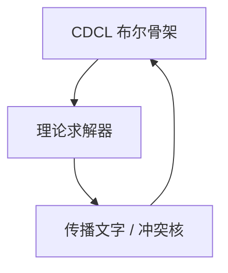

# SMT 求解器

SAT 模理论：命题骨架仍由 CDCL 管，算术、数组、位向量各有判定器，通过理论传播与冲突把等式送回布尔层。Nelson–Oppen 组合无量词的稳定理论。

<footer>—— 据 Nelson and Oppen, 1979；Barrett et al., SMT-LIB；Kroening and Strichman 整理</footer>

上一课[CDCL](/cs/dpll-cdcl) 只懂 0-1 子句。Hoare 的 VC 含 $i+1<n$、数组读。缺口是 **SMT**：$\mathrm{QF\_LIA}$、$\mathrm{QF\_BV}$、数组。本课钉 DPLL(T) 形状，不把一阶完全性请回来——带量词的碎片许多不可判定，求解器靠实例化启发式。

## 问题

原子可以是 $x+y\le 3$、$a[i]=v$。布尔结构仍 CNF。理论求解器 $T$：给定文字集，判定合取是否 $T$-可满足，并推出更多文字（传播）或解释。冲突：理论不可满足的核，学布尔子句。等式共享用 E-图（Congruence closure）。Nelson–Oppen：稳定、无量词、签名不交的理论，靠等式交换组合。

位向量：本质是 SAT 爆破或位级传播，规模随位宽。

### 不是「Prolog」

SMT 主要无量词或有限实例化。Horn 子句、Prolog 是另一搜索。Z3 能跑的量词是 E-matching，不完备。

Nelson–Oppen 1979。DPLL(T)：Nieuwenhuis、Oliveras、Tinelli。SMT-LIB 标准。Kroening–Strichman 教材。本课不写 Simplex 全部枢轴。

## 方法

举 $x=y\land f(x)\ne f(y)$ 的冲突（同余）。举线性不等式与布尔开关。指出：不可判定理论被切成可判定的 QF 碎片。对照[谓词逻辑](/cs/predicate-logic) 的一般不可判定：SMT 活在可判定岛上。

## 机制

程序验证：wp 生成一阶 VC，量化数组用选择公理图式实例化，落到 QF 片段再 SMT。失败模型给反例赋值。可靠相对理论公理；完备只在声明的可判定碎片内。

与 LWE、数论无关：整数在 SMT 里是线性算术，不是 RSA 模。

Simplex 处理 QF_LRA；位向量可 bit-blast 成 SAT。数组：读写公理 $\mathrm{read}(\mathrm{write}(a,i,v),j)$。字符串、浮点是后加理论，可判定性各异。量词实例化不完备：助手 hammers 调用 SMT 得到的是「这碎片上 sat/unsat」，不是一阶完备性。与模 $pq$ 密码算术不是同一求解器配置。

## 边界

本课不列全部 SMT-LIB 逻辑，不写字符串理论。不把神经网络验证当主线。后课默认：含算术的 VC 走 DPLL(T)。下一课交互证明助手与依值类型，补上 SMT 不覆盖的构造性证明。

DPLL(T) 让算术、数组、位向量把文字传播回 CDCL。可判定性停在声明的 QF 碎片；量词 E-matching 不完备。VC 生成之后的自动层在此；构造性证明对象下一课助手。

上一课留下的缺口在本课收口；「SMT 求解器」进入后课词汇表后只引用。文献用来钉对象与边界，不把本课写成该主题的独立综述。

## 小结

- SMT = CDCL + 理论判定/传播。
- 无量词稳定理论可 Nelson–Oppen 组合。
- 量词靠启发式；一般一阶仍不可判定。
- 出处：Nelson and Oppen, 1979；SMT-LIB；Kroening and Strichman。
