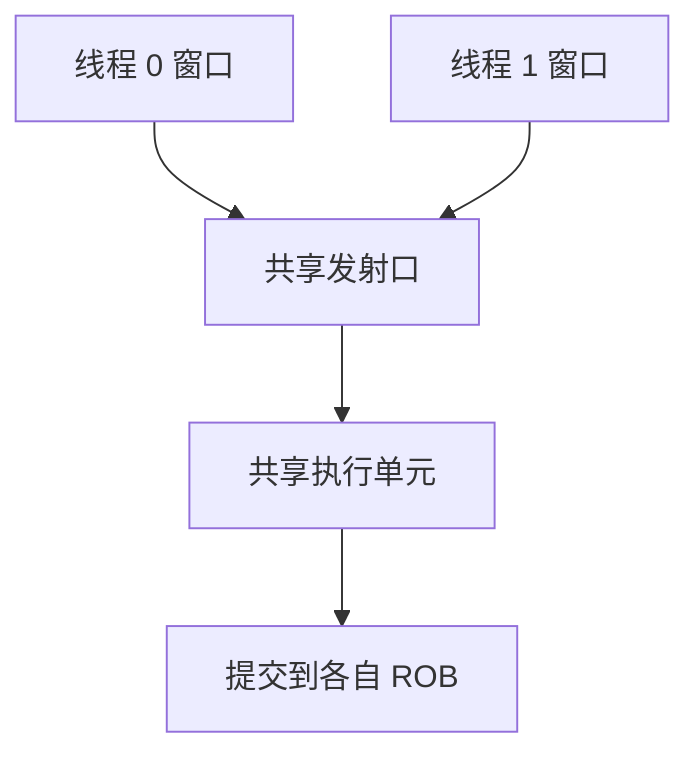

# SMT

一条流水线的空档，另一条硬件线程的就绪指令可以填；保留站和 cache 变成共享，单线程 IPC 往往略降。

<footer>—— 据 Tullsen, Eggers and Levy, Simultaneous Multithreading: Maximizing On-Chip Parallelism, ISCA 1995；Hennessy and Patterson, CA:AQA 整理</footer>

[上一课](/cs/store-buffer)让访存队列托住未提交写。[IPC 与利用率](/cs/ipc-util)写明实测 IPC 常远小于宽度：相关、缺失、误预测造成空槽。本课不重讲绕过。缺口是同时多线程（SMT）：同一核上多个逻辑处理器共享取指/发射/执行，每拍可从两条以上线程各取指令，用别的线程的 ILP 填本线程的停顿。

## 问题

单线程在 load 缺失时，ROB 头堵住，后面即使有独立 ALU 也很快耗尽窗口。再加宽超标量，窗口仍是**同一条依赖链**。缺口不是 SIMD（那是下一课的数据级），而是**再取一条不相关的指令流**：它有自己的 PC、寄存器重命名表、ROB 段或线程 ID 标签。

Tullsen 等人把同一拍发射来自多线程的指令叫做 SMT，以别于粗粒度切换（一缺失才换线程）。

操作系统看见的是多个 CPU。架构状态（寄存器、控制寄存器、ASID）每线程一份；L1 与执行单元共享。

## 方法

每线程：PC、寄存器映射、部分 ROB。共享：保留站、ALU、cache、MSHR、store 缓冲（项上打线程号）。发射选择：轮转、或优先未停顿线程。冲刷只杀该线程的投机状态。

存储缓冲查找必须带线程号，否则会把另一线程的 store 转发给自己。TLB 用各自 ASID，上一课已经允许两项共存。

## 机制

核级吞吐（两线程 IPC 之和）上升；单线程延迟可能变差，因为带宽被抢。[阿姆达尔](/cs/cpi-amdahl)对「只有一条线程」的程序：SMT 几乎不帮，还可能因 cache 污染变慢。适合混合：一条算、一条等内存。

安全与 QoS：侧信道可以共享 cache 当信道，本栏不展开；操作系统可关 SMT。本课只钉性能机制。

## 边界

本课不引入 GPU 的 SIMT 调度，不把超线程商标当正文。多核是「复制整核 + 共享 LLC」，与 SMT「复制架构状态、共享执行」不同轴；后课才走多核。SIMD 用一条指令打一条向量，也不靠第二套 PC。

后课默认：空档可用另一硬件线程填。规则排列的同构运算，下一课用 SIMD 收指令数。

## 小结

- SMT：多套架构状态共享流水线，用别的线程填停顿。
- 队列与缓冲必须打线程号；单线程 IPC 可能下降。
- 数据级并行（SIMD）是另一轴，下一课。
- 出处：Tullsen, Eggers and Levy, *ISCA*, 1995；Hennessy and Patterson, *CA:AQA*。
