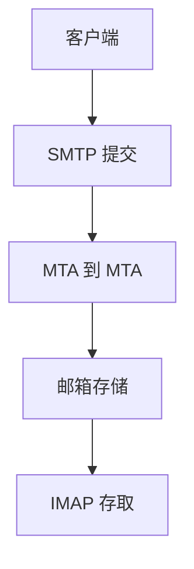

# SMTP / IMAP

SMTP 在 MTA 之间推送邮件；IMAP 让客户端在服务器上管理邮箱。提交与投递端口、TLS 时机不同，都不是 HTTP。

<footer>—— 据 RFC 5321 SMTP；RFC 9051 IMAP4rev2 整理</footer>

[上一课](/cs/geodns) 不传邮箱。[DNS MX](/cs/dns-rr) 已点名记录。缺口是**邮件运输与存取**：SMTP 对话、IMAP 选文件夹。本课不把 SPF 写完。

## 问题

邮件要跨管理域、要存、要多设备。SMTP：MAIL FROM、RCPT TO、DATA，MTA 跳到跳，MX 决定下一跳。提交（587）与传输（25）政策不同。IMAP：TCP 上命令取消息，状态在服务器；POP 对照为下载删除，点名。持久连接、大附件 MTU、超时与无线半开都出现。不是 REST 资源模型。

不要把 Gmail 网页当协议。

RFC 5321。STARTTLS 升级。本课不把每条 SMTP 代码背完。

### 投递链与邮箱存取

SMTP 跳到跳，IMAP 状态在服务器。逐跳 TLS 不是端到端密信。网页邮箱不是协议。

## 方法

画：MUA → 提交 → MTA 链 → 投递 → IMAP 取。对照 HTTP POST：无统一缓存，有队列与重试。与 QUIC：邮件仍多 TCP。

方法止于选定对象与对照；机制才说它如何嵌入已有分层与主干课。

## 机制

DNS 缓存 MX 影响切换。TLS 对 SMTP 是逐跳，不是端到端密信（那是 OpenPGP/S/MIME，点名）。负载均衡对 25 端口要小心会话。分块附件像 HTTP 体，但边界是 MIME。

垃圾与伪造下一课认证。保活防止 NAT 拆 IMAP。

## 边界

本课不引入 JMAP 的全部。SPF/DKIM/DMARC 是下一课。后课默认：SMTP 推送投递；IMAP 远程邮箱。

把 25 对全世界开放中继会成为垃圾跳板。

上一课留下的缺口在本课收口；「SMTP / IMAP」进入后课词汇表后只引用。文献用来钉对象与边界，不把本课写成该主题的独立综述。下一课[SPF / DKIM / DMARC](/cs/spf-dkim-dmarc)。

## 小结

- SMTP 管投递链；IMAP 管邮箱访问。
- MX 与逐跳 TLS 是核心机制。
- 与 HTTP 会话模型不同。
- 后课只引用本课钉死的对象，不从该领域总问题重开。
- 出处：RFC 5321；RFC 9051。
