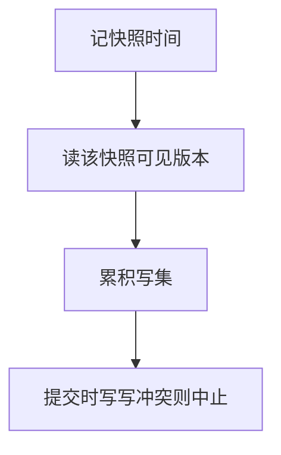
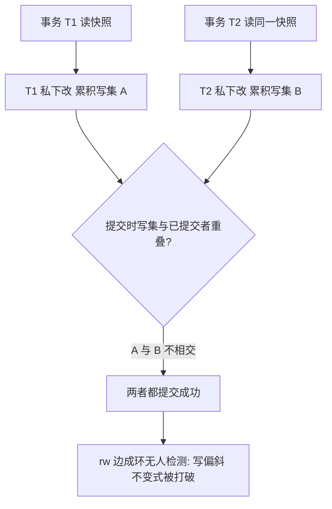

# 快照隔离

事务读一个已提交快照，写在提交时若写集与并发已提交者冲突则中止；它不是冲突可串行，但很常见。

<footer>—— 据 Berenson et al., SIGMOD 1995；Reed 对多版本；Ramakrishnan 对照</footer>

[上一课](/cs/mvcc)让读选可见版本、写建新版。本课不重写可见性函数。缺口是广泛实现的一种调度：**快照隔离（SI）**。读不取锁，提交时检查写–写。幻读与写偏斜下一课专收。隔离级别表更后。

## 问题

MVCC 课留下「读按快照」。SI 把快照钉在事务开始（或第一条语句），提交用「第一提交者胜」的写集冲突：与已提交的重叠写则 abort。它禁止脏读、不可重复读（对自己的快照），仍允许下一课的写偏斜。缺口是**把 SI 从「有版本」里命名出来**，避免当成可串行。

术语翻译：「第一提交者胜」就是——两个事务改同一行时，谁先走到提交那一刻谁赢，后到者整个回滚重试。注意它只比较**写集**：读过的数据不参与检查，这正是写偏斜能从检查缝里溜过去的原因。

SSI（可串行快照隔离）后来加冲突监测逼近可串行。主干先钉经典 SI，不把 SSI 当默认。

## 方法

开始：记 startTS。读：最新的 committedTS $\lt$ startTS 的版本（加上自己的写）。写：私有直到提交，再分配 commitTS 并检查写集。失败则整个事务撤，靠 WAL UNDO。本课不把每家数据库默认级别写成同一 SI。

```mermaid
flowchart TD
  START["记快照时间"] --> READ["读该快照可见版本"]
  READ --> WSET["累积写集"]
  WSET --> CHK["提交时写写冲突则中止"]
```

## 机制

SI 用版本换掉读锁，写锁或占用仍常在，避免 ww。冲突可串行要求的 rw 边可以成环而不被检测——写偏斜。后课用保险与医生的经典例子说明规格差在哪。对只读只读快照，近似理想。

```mermaid
flowchart TD
  T1["事务 T1 读快照"] --> W1["T1 私下改 累积写集 A"]
  T2["事务 T2 读同一快照"] --> W2["T2 私下改 累积写集 B"]
  W1 --> C{"提交时写集与已提交者重叠?"}
  W2 --> C
  C -- "A 与 B 不相交" --> OK["两者都提交成功"]
  OK --> BR["rw 边成环无人检测: 写偏斜 不变式被打破"]
```

数字实例：把时间戳当序号看——T1 的 startTS=100，T2 的 startTS=101，两者读到的都是 100 之前已提交的版本；T1 commitTS=105 先到，T2 commitTS=106 后到。若都写第 7 行，T2 撞上 T1 的已提交写集、整个回滚；若写的行不相交，则双双成功——而业务不变式可能已经坏了。

## 边界

本课不把快照当备份工具（时间点恢复是日志另一用法）。哪些异常 SI 还放行，下一课幻读与写偏斜。

常见误区：以为「没有脏读、没有不可重复读」就等于数据安全。SI 只保证你看到一致快照、你的写不与他人撞车；两个事务各改各的、合起来破坏业务不变式（例如「值班医生至少一人在线」），SI 并不拦截——这要等 SSI 加冲突监测，或者显式上锁。

后课默认：SI 是 MVCC 上最常见的产品点。它还不是可串行。

## 小结

- SI：读快照，提交查写集。
- 无脏读，仍可能写偏斜。
- 幻读与写偏斜下一课。
- 出处：Berenson et al., 1995；Reed 1978。
