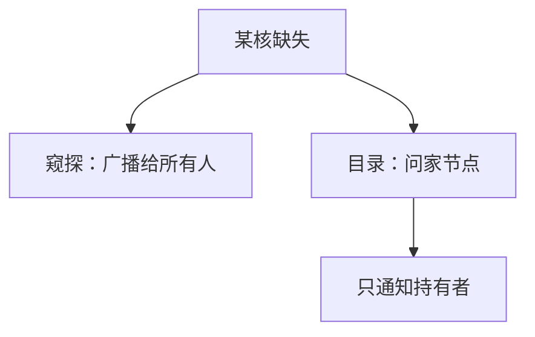
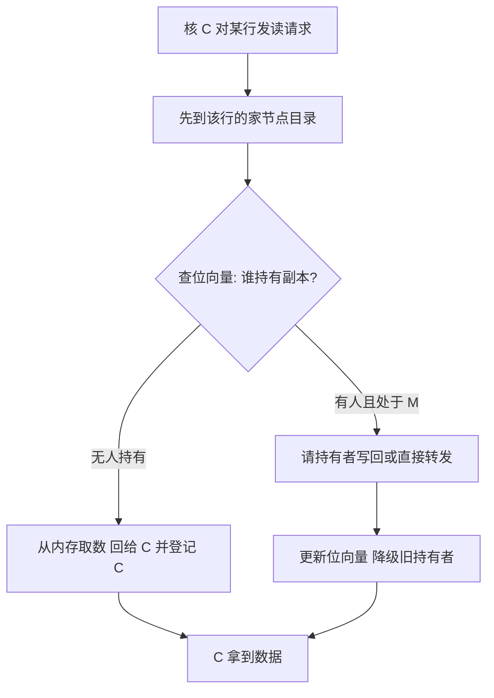

# 侦听与目录

MESI 的状态机还要靠一种传播手段：每人听总线上所有事务，或向目录打听谁持有副本。

<footer>—— 据 Censier and Feautrier, A New Solution to Coherence Problems in Multicache Systems, IEEE TC 1978；Hennessy and Patterson, CA:AQA 整理</footer>

[上一课](/cs/mesi-protocol)钉了 M/E/S/I 转换，并假定「每核看见总线上的读/写」。核数上升时广播先垮。[多核与共享缓存](/cs/multicore-shared-cache)已把互连画成抽象。本课不重画四态。缺口是传播：窥探（snoop）对广播介质，目录把「谁有这行」记在主节点。本课只对照这两种，不写目录项的全部编码。

## 问题

窥探：每条 miss/upgrade 出现在共享总线或广播网上，所有 cache 控制器比较自己的标签并作答（提供数据、作废、降级）。正确性靠「人人看见同一全序事务」。缺口是带宽与监听过滤随核数线性涨——包含性 L3 只能过滤一部分。

目录：每行有一个家节点，存位向量或链表：哪些核可能有副本。请求先到家，家只向有副本的核发点对点消息。无广播，但多一跳延迟，且目录本身要存储。

直觉类比：窥探像微信群发——每个人都得看一眼、回一句「与我无关」；目录像问总台——先查登记簿，只给真正持有副本的人打电话。核少时群发快（一跳人人知道），核多时总台省带宽（只联系持有人），代价是多一跳延迟加一份要维护的登记簿。

Censier–Feautrier 1978 给出目录方案的早期完整表述。总线窥探与 Illinois MESI 同一时代，对象是小规模对称多处理。

## 方法

窥探实现：总线仲裁给出全局序；写升级等待所有 snoop 响应。监听过滤器、包含 LLC 用来减少 L1 被问的次数。

目录实现：数据请求 → 目录；若行在 M，转发到持有者，持有者写回或直接给请求者，目录更新位向量。替换通知目录（或用超时/静默替换加后续探测）。

```mermaid
flowchart TD
  MISS["某核缺失"] --> BUS["窥探：广播给所有人"]
  MISS --> DIR["目录：问家节点"]
  DIR --> P2P["只通知持有者"]
```

两种都实现同一套 MESI 不变式；变的是消息条数与延迟分档。

数字实例：64 核机器上，位向量按核记位，一个目录项只多 8 个字节；而窥探要每条缺失都打扰其余 63 个核的控制器。核数翻到 128，广播的条数还在线性涨、总线带宽却不涨——这正是大规模芯片几乎都换目录方案的账面理由。

## 机制

窥探的「最近写」由总线序定义。目录的「最近写」由家节点序列化到该行的请求定义——同一行仍有全序，不同行之间的序是存储模型的事，下一课。

```mermaid
flowchart TD
  R["核 C 对某行发读请求"] --> H["先到该行的家节点目录"]
  H --> S{"查位向量: 谁持有副本?"}
  S -- "无人持有" --> M["从内存取数 回给 C 并登记 C"]
  S -- "有人且处于 M" --> F["请持有者写回或直接转发"]
  F --> U["更新位向量 降级旧持有者"]
  M --> D["C 拿到数据"]
  U --> D
```

这张图回答「目录协议一次读请求到底走几步」：请求先到家里查登记，再按持有情况分岔——干净时一次内存读就完，脏时还要惊动旧持有者写回。与窥探「一嗓子喊全屋」相比，每一步都是点对点，消息条数从 $O(n)$ 降到 $O(1)$ 上下。

NUMA：目录切片跟内存走，远程行必经互连。窥探很难跨太多芯片。包含层次与目录可叠加：LLC 当本节点过滤器。

## 边界

本课不引入 MOESI 的 Owned 作为传播优化（脏共享不写回内存），不把具体互联协议当正文。也不把目录当成操作系统页表：粒度是 cache 行，由硬件维护。存储一致性模型（SC/TSO）下一课才问多地址交错。

常见误区：把目录当成软件层的页表。目录项的粒度是 cache 行、由硬件在纳秒级维护，操作系统完全看不见它，它也不管虚拟地址翻译。另外目录不是「处处变慢」——本地行照旧，只有跨节点的行才多付那一跳。

后课默认：小规模用窥探，大规模用目录；MESI 状态仍适用。程序员问「两条 store 他核怎么看见」，要另加模型。

## 小结

- 窥探靠广播与人人监听；目录靠家节点与点对点。
- 不变式仍是 MESI；变的是可扩展性与延迟。
- 多地址上的可见顺序是下一课存储模型。
- 出处：Censier and Feautrier, *IEEE TC*, 1978；Papamarcos and Patel, *ISCA*, 1984；Hennessy and Patterson, *CA:AQA*。
