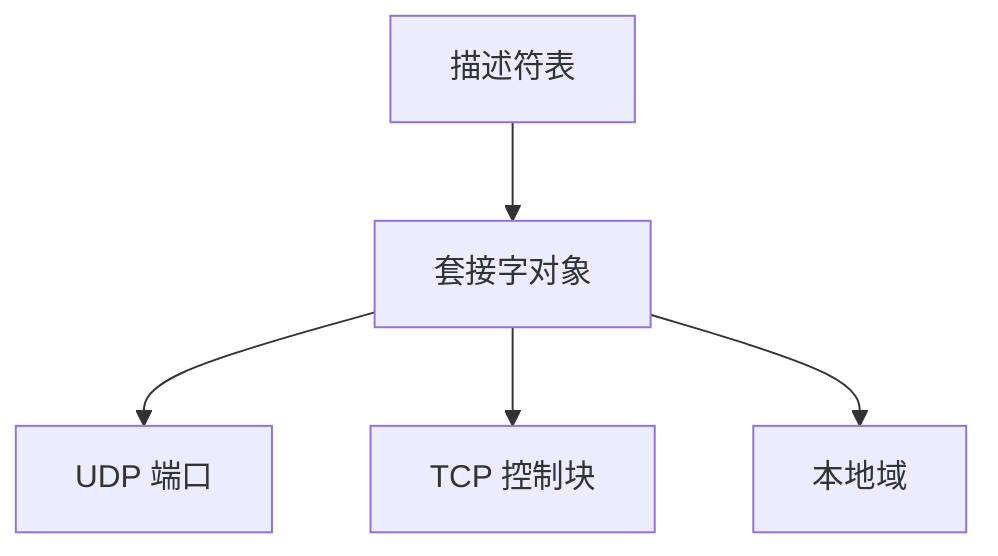

# 套接字 API

套接字是进程眼里的通信端点：像文件描述符一样 read/write，底下却是 UDP、TCP 或本地字节。

<footer>—— 据 Leffler 等 BSD；Stevens, UNIX Network Programming 整理</footer>

[上一课](/cs/anycast-edge)把对象放到边上，应用仍要写代码收发。[进程](/cs/process-image)、[文件字节流](/cs/file-bytestream)、[系统调用](/cs/syscall-path)已齐；[UDP](/cs/udp) 与 [TCP 握手](/cs/tcp-handshake)已齐。缺口是把它们接起来的 **Berkeley 套接字**：内核对象 + 描述符。本课不进入关系模型。

## 问题

若每个协议一套系统调用，用户程序无法 `select` 等待磁盘与网卡。套接字把传输端点放进描述符表：`socket` 分配，`bind` 钉本地地址端口，`listen`/`accept` 接 TCP，`connect` 做握手，`send`/`recv` 搬字节。缺口不是再讲 LPM，而是这条用户接口。Unix 域套接字用同一套调用走[管道](/cs/ipc-pipe)式本机路径。

本课不把 `epoll` 的全部边缘触发写完。

TCP 套接字是流，无消息边界；UDP 是数据报，`recv` 一次一报。类型在 `socket()` 的 `SOCK_STREAM` / `SOCK_DGRAM` 选定。

## 方法

服务器：`socket` → `bind` → `listen` → 循环 `accept` 得新描述符 → fork 或线程处理。客户端：`socket` → `connect`。DNS 通常在 `getaddrinfo` 里先于 `connect`。阻塞调用沿用 OS 睡眠；就绪则下半部唤醒。错误经返回值，不像 mmap 缺页信号。

## 机制

套接字是网络课收束到 OS 课的钉子：协议栈在内核（或用户库 + UDP），进程只看见描述符与字节。与 [VFS](/cs/vfs) 并列：有的内核把套接字当一种文件操作表。CDN、HTTP、TLS 库都在这上面叠用户态逻辑；[TLS 握手](/cs/tls-handshake)改变的是写入描述符之前是否加密，不是描述符本身。

地址族 `AF_INET`/`AF_INET6` 接 [IPv6 对照](/cs/ipv6-contrast)。关闭描述符可触发 TCP 拆除，本课不画 TIME_WAIT。

## 边界

本课不引入原始套接字抓包的全部权限模型。不把 Windows IOCP 当另一理论。数据库下一课从关系模型另起：套接字可以运 SQL 字节，但不定义表。

`SO_REUSEADDR` 与绑定冲突、`TCP_NODELAY` 关 Nagle，都是套接字选项，不改协议状态机本身。本课默认阻塞 I/O。

后课默认：应用经套接字使用本栏已讲的传输与网络。计算机栏下一课程是数据库：关系模型从「字节流里的表」另起抽象。

## 小结

- 套接字 = 可 `read`/`write` 的传输端点，挂在进程描述符表上。
- TCP 流、UDP 报、本地域共用调用形状。
- 主干网络课到此收束；握手密码学在安全课，数据模型在数据库课。
- 出处：Stevens, *UNIX Network Programming*；BSD 套接字接口；Silberschatz et al. 网络子系统。
