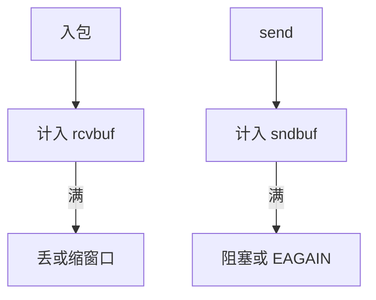

# 套接字缓冲与背压

每个 sock 有接收与发送内存会计：队列里的 sk_buff 计入 rmem/wmem，满了就对应用或对 TCP 窗口施压，而不是在网卡上无限堆。

<footer>—— 据 POSIX SO_RCVBUF/SO_SNDBUF；Linux 对 sk_buff 会计与 tcp_mem 的说明；Stevens, <em>UNP</em></footer>

[上一课](/cs/tx-path-qdisc)会在 qdisc 丢包。[RX](/cs/rx-path) 会把 skb 挂进 sk。缺口是 **套接字缓冲**：谁付钱、何时 `EAGAIN`、TCP 窗口如何跟着变。

## 问题

读者慢，内核若无限排队，内存被一个连接吃光。`sk_rmem_alloc` 超 `sk_rcvbuf` 则 drop 或缩小窗口。发送：未确认数据占 `sk_wmem`，满则 `send` 阻塞或 EAGAIN。缺口：自动调优（tcp_moderate_rcvbuf）；cgroup 的 memory 与 net 会计交叉；UDP 无窗口，只能丢。本课不把每条 sysctl 当考纲。

SO_SNDBUF 是提示，内核常加倍记账。unix 域套接字也有类似缓冲，不经 qdisc。

## 方法

`recv`：从 sk 队列剥 skb，拷到用户（或 zerocopy），减会计，可能发窗口更新。`send`：分配 skb，会计加，进 TCP 发送队列，再走 TX。对照 [页缓存](/cs/page-cache)：文件脏页有 writeback；套接字没有盘，只有对端 ACK 或本地读。对照 blkio：那是块设备，这里是字节流内存。

## 机制

背压把端到端的「谁更快」收成内核计数器，保护主机。TCP 把接收缓冲翻译成通告窗口，于是慢读者压住快写者——这是传输课在 OS 里的落点。不要写成量化订单流控。

与 [NAPI](/cs/napi)：NAPI 配额是 CPU 时间；rmem 是内存。两者都会 drop，原因不同。

实现上：tcp_rmem 三元组是自动调优的范围，SO_RCVBUF 会关掉自动。内存压力下 tcp_mem 进入压力档，强制缩小窗口。unix 套接字的缓冲是内核内存，也进 memcg。 读法上只引用[上一课](/cs/tx-path-qdisc)的结论，不把对象换成训练推理或限价簿。

本课在操作系统进阶的「网络栈 / 收发路径」课序里，对象是 **套接字缓冲与背压**。

- 先修只引用，不重导：上一课的结论当公理，本课只补差。
- 五栏不吞并：不把本课写成大模型训练/推理，也不写成限价簿或权重量化。
- 文献用 OSTEP、McKusick、内核文档与具名会议论文；不发明 arXiv 编号。

## 边界

本课不引入 `tcp_notsent_lowat` 的全部应用调优。不保证 RDMA 的 QP 缓冲走同一会计。下一课把 TCP 状态机在内核里的要点钉住，而不重开拥塞控制数学全文。

版本字段会变，课序钉的是机制对象「套接字缓冲与背压」，不是某一主线内核的结构体名。
后课默认：套接字有内存上限并反向施压。内核 TCP 实现的队列与定时器要点，下一课。

## 小结

- rcv/snd 缓冲会计限制每连接内存。
- 满则丢、缩窗口或阻塞应用。
- 内核 TCP 要点是下一课。
- 出处：Stevens *UNP*；Linux tcp；POSIX socket 选项。
