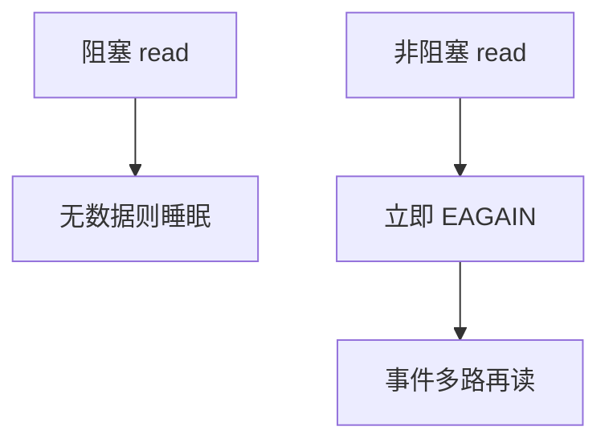

# 阻塞与非阻塞套接字

默认 read 会把进程睡到有字节；非阻塞让调用立即返回「现在没有」，由事件通知再来读。

<footer>—— 据 Stevens, UNIX Network Programming；Kurose and Ross 对套接字的整理</footer>

[上一课](/cs/socket-api)把 UDP/TCP 接到文件描述符：`connect`、`accept`、`read`、`write`。本课不重列调用。缺口是等待：阻塞套接字上，对端慢则线程卡在系统调用里；并发连接若一人一线程，[进程/线程](/cs/thread-shared-addr) 成本会先爆。非阻塞加多路复用是同一 API 上的调度合同。网络课在此结束，下一课关系模型。

## 问题

Berkeley 套接字默认阻塞：无数据则睡眠，缓冲满则写睡眠。这与[文件字节流](/cs/file-bytestream)一致，但网络延迟是对端与路径，不是磁盘臂。服务器要同时服务许多已建立连接，不能为每个 `read` 配一个内核线程当默认。缺口是**调用是否等待就绪**，不是新的 TCP 状态。

`select`/`poll`/`epoll`/`kqueue` 都是「等这些描述符可读可写」。本课只钉合同，不选哪一个可移植层。

## 方法

设非阻塞：`read` 无数据返回 EAGAIN；`connect` 可在进行中返回。事件循环：注册描述符，醒来后在就绪集合上读写，直到再次 EAGAIN。阻塞套接字仍适合简单客户端。半关闭与 [TIME_WAIT](/cs/tcp-time-wait) 不因非阻塞消失。

## 机制

非阻塞把等待从「藏在系统调用里」变成「进程自己调度」，与内核[时间片](/cs/timeslice-cfs) 分工：内核仍唤醒，用户决定先服务谁。它不改 TCP 窗口与拥塞；只改线程是否被占住。数据库课即将开始：套接字送来的是字节，还没有表。

## 边界

本课不把异步 I/O 的全部 POSIX 接口写完，不引入用户态协议栈。字节如何变成元组集合，下一课关系模型。

后课默认：网络端点可以不阻塞线程。持久共享数据需要关系，而不是再开一种套接字。

## 小结

- 阻塞等待就绪；非阻塞立即返回，靠多路复用再来。
- 不改变 TCP 语义，只改变进程调度。
- 计算机栏下一课进入关系模型。
- 出处：Stevens *UNIX Network Programming*；Kurose and Ross。
