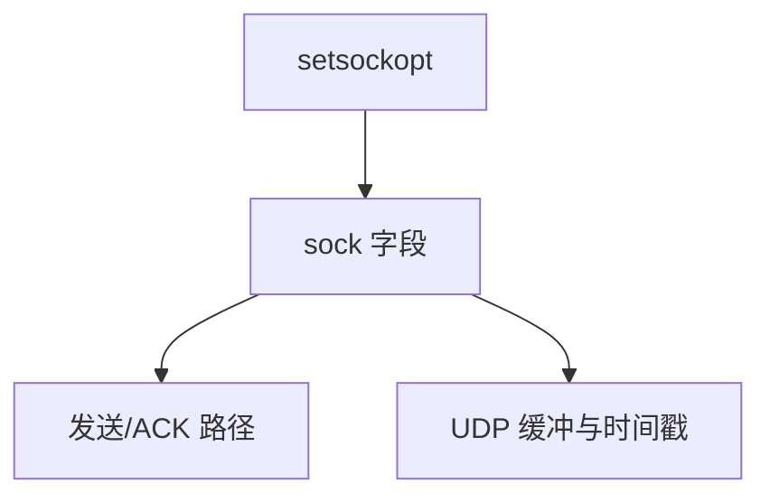

# 套接字选项

setsockopt 把传输与缓冲旋钮暴露给应用：不延迟、保活、地址复用、时间戳，而不改系统调用号。

<footer>—— 据 POSIX setsockopt；Stevens, <em>UNP</em>；Linux socket(7)、tcp(7)</footer>

[上一课](/cs/rdma-os)留下的缺口接到本课。 [TCP 实现](/cs/kernel-tcp-impl) 与 [缓冲](/cs/socket-buffers) 已有内核对象。应用通过 **套接字选项** 触及它们，而不是重编内核。网络栈课序在此收口，下一单元回到内存。

## 问题

默认 Nagle 合并小写；延迟 ACK 交互差。`TCP_NODELAY` 关 Nagle。`SO_REUSEADDR`/`SO_REUSEPORT` 管绑定。`SO_KEEPALIVE` 探活。`SO_TIMESTAMP` 把 RX 时间戳交用户。缺口：选项在 SOL_SOCKET vs IPPROTO_TCP 层；有的继承 listen，有的要在 connect 前设；与 [busy poll](/cs/napi) 的 `SO_BUSY_POLL` 接头。本课不把每一选项写成 man 页拷贝。

TCP_QUICKACK、CORK、MAXSEG 是同一层的细旋钮。错误的 REUSEPORT 负载均衡会打乱 CPU 亲和。

## 方法

`setsockopt(fd, level, opt, ...)` 改 `sock` 字段，后续 `tcp_sendmsg` 读这些字段。对照 [fcntl 文件锁](/cs/file-locking)：一个管文件劝告锁，一个管传输行为。对照 sysctl：全局默认，选项是 per-fd 覆盖。对照 RDMA：verbs 不走这套。

## 机制

选项把内核 TCP/UDP 的工程折中变成可调 ABI，使 HTTP 服务器与 SSH 能不同。它们不创造新协议。不要写成云负载均衡产品文档。与 netfilter：选项改端行为，不替代防火墙。

安全：有的选项要特权（如绑定低端口是另一件事，`IP_TRANSPARENT` 要 cap）。

实现上：SO_REUSEPORT 的哈希把同端口多监听器分流，和 RSS 一样怕连接不对称。TCP_USER_TIMEOUT 管未 ACK 数据的死亡，和 KEEPALIVE 探空闲不是一回事。 读法上只引用[上一课](/cs/rdma-os)的结论，不把对象换成训练推理或限价簿。

本课在操作系统进阶的「网络栈 / 收发路径」课序里，对象是 **套接字选项**。

- 先修只引用，不重导：上一课的结论当公理，本课只补差。
- 五栏不吞并：不把本课写成大模型训练/推理，也不写成限价簿或权重量化。
- 文献用 OSTEP、McKusick、内核文档与具名会议论文；不发明 arXiv 编号。

## 边界

本课不引入 MPTCP 的 sockopt 全集。不保证 Windows 同名选项语义——[NT 对照](/cs/windows-nt-contrast) 后课。内存进阶第一课：页如何被反向找到，以便回收与 unmap。

版本字段会变，课序钉的是机制对象「套接字选项」，不是某一主线内核的结构体名。
后课默认：应用可用 sockopt 调缓冲与 TCP 行为。内核如何从物理页反查映射，下一课 rmap。

## 小结

- sockopt 是 per-socket 的内核旋钮。
- 分层在 SOL_SOCKET 与协议级。
- 反向映射 rmap 是下一单元。
- 出处：Stevens *UNP*；Linux `socket(7)`、`tcp(7)`；POSIX。
