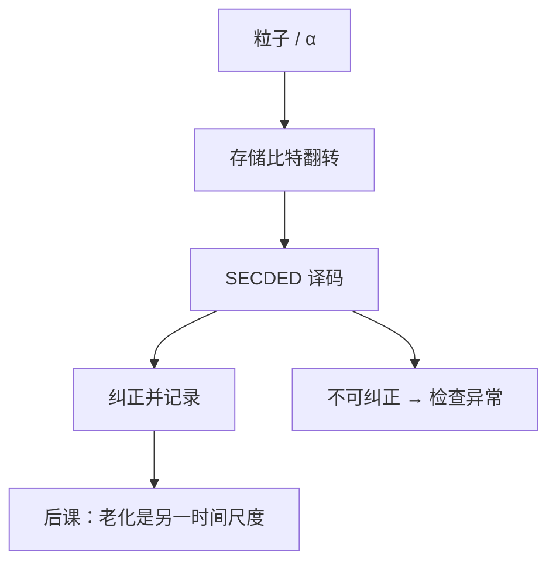
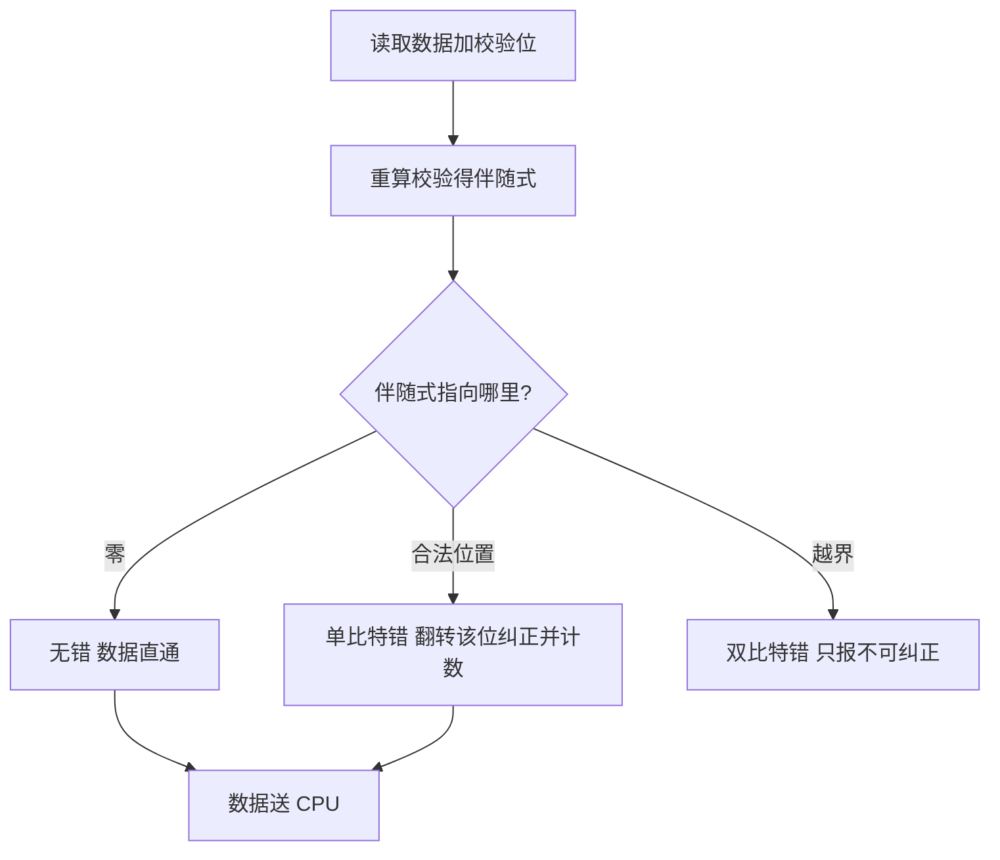

# 软错误与 ECC 内存

  
粒子打中 SRAM 或 DRAM 电容，比特翻转而晶体管并未损坏；纠错码把可纠正的翻转从故障里分开，扫描测试看不见这一类。

  <footer>—— 据 Baumann, Soft Errors in Advanced Computer Systems, IEEE Micro 2005；Hamming 编码先修；JEDEC 与服务器内存实践 整理</footer>

[上一课](/cs/bist)抓制造与部分老化硬缺陷。组成课已有[DRAM 刷新](/cs/dram-refresh)与[汉明码](/cs/hamming-code)。缺口是运行期 **软错误（SER）**：SEU 翻转存储节点，功能上像随机写，扫描链当时可能是好的。

## 问题

宇宙射线中子、封装 α 粒子在扩散区产生电荷，SRAM 位单元翻转阈值随工艺变低。DRAM 电容也可被扰，但机制与刷新丢失不同。缺口不是再讲 March 算法，而是：**检测/纠正**要做在数据通路上——ECC 旁路、寄存器文件奇偶、流水线保护。

术语翻译：软错误的「软」不是软件的软——是硬件没坏、只有信息坏了：粒子打翻一个比特，重写一遍就恢复。所以扫描测试当时测一切正常，故障却已经发生过；这与制造缺陷（硬故障）属于两套完全不同的可靠性门类。

SECDED（单纠正双检测）常用于缓存与 DIMM。芯片杀（chipkill）把符号分布到多个颗粒，对照后课 DRAM 组织。本课钉「软错误 ≠ 硬故障」与 ECC 的位置。

数字实例：SECDED 的开销算一下——保护 64 位数据要 8 个校验位（含一个整体偶校验位），所以服务器 DIMM 是 72 位宽对 64 位数据。每 8 字节多付 1 字节、约 12.5% 的容量税，换来「纠 1 检 2」。

### ECC 不是「BIST 的另一种签名」

BIST 压缩的是测试响应；ECC 是功能数据的冗余，每拍（或每次读）算。把二者合成一种「校验」，会在该不启动 BIST 的功能路径上误插 LFSR。软错误纠正后程序继续；不可纠正则机器检查异常——OS 课再接，本课承认有 UE 信号。

Baumann, *IEEE Micro*, 2005 是软错误综述名篇。Hamming/SECDED 在信息论课已有。JEDEC DDR 规范含 ECC DIMM 的数据宽度（如 ×72）。本课不编造 FIT 数字表。

## 方法

读：数据+校验进译码器，纠正后送 CPU，写回可选。写：编码器生成校验。部分写要先读–改–写以免校验不一致。寄存器与 FF：关键控制用三重化（TMR）或只对地址/状态奇偶。FPU 数据路径是否 ECC 是成本选择。

```mermaid
flowchart TD
  PART["粒子 / α"] --> SEU["存储比特翻转"]
  SEU --> ECC["SECDED 译码"]
  ECC --> CE["纠正并记录"]
  ECC --> UE["不可纠正 → 检查异常"]
  CE --> LATER["后课：老化是另一时间尺度"]
```

扫描测试通常不注入粒子；SER 用加速试验与 FIT 模型估计，属可靠性工程，与 ATPG 分家。

## 机制

下一课老化（NBTI、电迁移）让延迟漂移，表现为时序违例而非单比特翻转。DRAM 组织课会看到 rank/bank 上的 ECC 布局。本课先把「运行期随机翻转」钉进数字系统课序的可靠性入口。

```mermaid
flowchart TD
  R["读取数据加校验位"] --> SY["重算校验得伴随式"]
  SY --> C{"伴随式指向哪里?"}
  C -- "零" --> OK["无错 数据直通"]
  C -- "合法位置" --> FIX["单比特错 翻转该位纠正并计数"]
  C -- "越界" --> DET["双比特错 只报不可纠正"]
  OK --> FWD["数据送 CPU"]
  FIX --> FWD
```

这张图回答「SECDED 一次读到底怎么判」：重算校验得伴随式，零是无错、命中合法位置纠一位、越界说明至少坏两位只能上报。直觉上，校验位给每个合法码字圈出一个「半径 1」的专属邻域——落进邻域的错能拉回原位，落在邻域之间的错只能报警。

## 边界

本课不讲辐射加固工艺细节，不把纠错当密码学。不进入量子计算误码。不把 ECC 内存的通道时序写完——那是 DDR 课。

常见误区：以为装了 ECC 内存就「不会错」。SECDED 只纠单比特、检双比特；同一次访问坏到第三位，照样不可纠正、机器检查异常。chipkill 解决的是「一整颗颗粒掉线」的场景，不是把错误率清零——它换的是故障覆盖面，不是物理规律。

后课默认：软错误是可恢复或不可纠正的随机位翻转；功能 ECC 与制造 BIST 分工。

## 小结

- BIST 对硬缺陷；软错误是运行期 SEU。
- SECDED 在读路径纠正并报告；UE 另处理。
- 扫描当时通过不保证现场无翻转。
- 出处：Baumann, *IEEE Micro*, 2005；汉明码先修；JEDEC ECC DIMM 实践。
