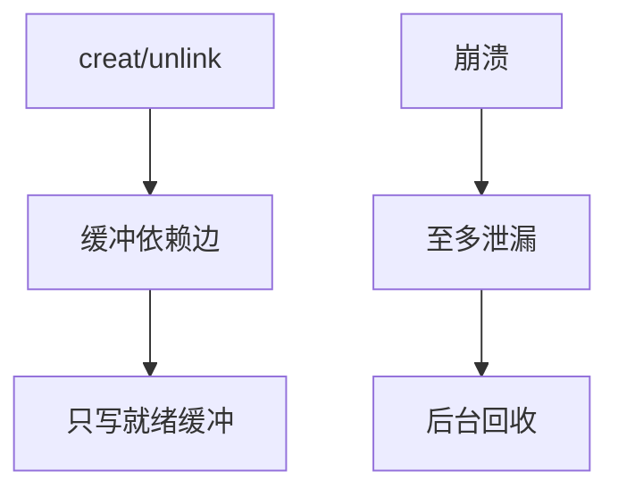

# 软更新对照

软更新不写日志：它在内存里给缓冲更新排依赖，使落盘顺序永远保持「先指针后对象」或反过来的安全方向，崩溃后至多泄漏，不交叉指错。

<footer>—— 据 Ganger, McKusick, Patt et al., Soft Updates: A Technique for Eliminating Most Synchronous Writes in the Fast Filesystem, ACM TOCS 2002</footer>

[上一课](/cs/fs-snapshots)把一致切面交给 COW 根。[日志](/cs/ext4-journal) 把更新抄到旁路。[LFS](/cs/log-structured-fs) 把盘当成日志。FFS 还可以走第三条路：**软更新**。本课是对照，不是劝你在 Linux 上启用它——Linux 主线走的是日志与 COW。

## 问题

无序写回时，目录项可能指向未初始化的 inode，或位图显示空闲但文件仍指向该块——fsck 必须修交叉。若每次元数据都同步，性能崩。[fsync](/cs/fsync) 只等待一个文件。缺口：给脏缓冲加依赖边（「这块必须先于那块」），循环依赖则先回滚内存里的部分更新、写盘、再重新挂上。崩溃后文件系统总是一种可挂载的超集：可能有未回收的 inode/块，没有「已用对象指向垃圾」。

McKusick 在 BSD FFS 落地。依赖图的结点是缓冲，不是 POSIX 操作。与数据库 WAL 对照：这里没有 REDO 记录，只有写序。

## 方法

`creat`：先保证 inode 在盘上已分配且链接计数正确，再写目录项。`unlink`：先清目录项，再把 inode 计数与块释放排在后面。写回守护进程只选取依赖已满足的缓冲。与 JBD2：没有 journal inode，没有 commit 块；恢复靠后台 `fsck -p` 回收泄漏，通常很快，因为结构不坏。

## 机制

软更新把「崩溃一致」定义成**永不指向未初始化对象**，把泄漏交给 fsck。这比全量扫描修交叉便宜，又比重做一份日志少一次写。它不给快照当原语，也不给端到端校验当提交点。教学价值：同一 POSIX 树，至少三种实现——日志、COW、依赖序。

不要把软更新写成编译课的指令调度：虽然都是依赖图，对象是磁盘缓冲。

实现上：循环依赖时要 rollback 内存中的指针再写盘，等于短暂违背「内存即真相」。BSD 的后台 fsck 专门回收泄漏，所以软更新把正确性定义成「可挂载超集」而不是「无泄漏」。 读法上只引用[上一课](/cs/fs-snapshots)的结论，不把对象换成训练推理或限价簿。

本课在操作系统进阶的「文件系统实现 / 布局与日志」课序里，对象是 **软更新对照**。

- 先修只引用，不重导：上一课的结论当公理，本课只补差。
- 五栏不吞并：不把本课写成大模型训练/推理，也不写成限价簿或权重量化。
- 文献用 OSTEP、McKusick、内核文档与具名会议论文；不发明 arXiv 编号。

## 边界

本课不把 BSD 与 Linux 的缓冲层代码对译。不保证 USB 拔出时依赖都已满足。下一课把「泄漏与交叉」收成工具：fsck 实际扫什么、日志/COW 之后它还剩什么工作。

版本字段会变，课序钉的是机制对象「软更新对照」，不是某一主线内核的结构体名。
后课默认：原地 FS 可以用依赖序避免交叉。检查与修复程序如何走超级块、位图与目录，下一课 fsck。

## 小结

- 软更新用写序保证不交叉；崩溃至多泄漏。
- 对照日志与 COW：旁路抄写 vs 新根 vs 依赖图。
- fsck 的剩余工作是下一课。
- 出处：Ganger, McKusick, Patt et al., TOCS 2002；McKusick, *The Design and Implementation of the FreeBSD Operating System*。
