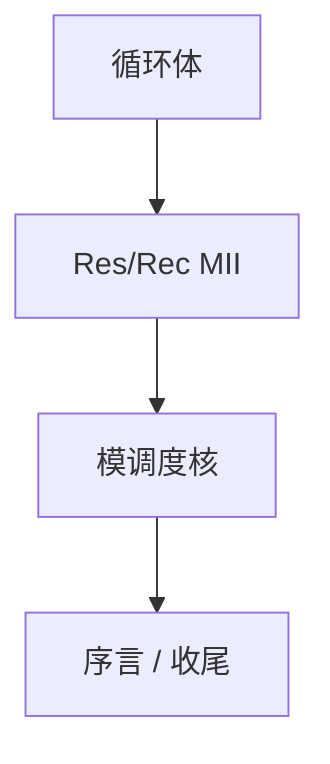

# 软件流水

模调度让连续迭代重叠：核（kernel）每 II 拍启动一圈，序言与收尾补满流水。目标是吞吐，不是单圈最短。

<footer>—— 据 Rau and Glaeser；Lam, Software Pipelining, 1988；Rau, Iterative Modulo Scheduling 整理</footer>

上一课[表调度](/cs/list-scheduling)优化单块。循环要**跨迭代重叠**。缺口是软件流水 / 模调度：启动间隔 II 受资源与环依赖约束。本课钉 II、kernel、prologue/epilogue，不写 VLIW 模板全部。

## 问题

表调度一圈内排完再下一圈，ALU 仍闲。流水：迭代 $i$ 的 load 与 $i+1$ 的算重叠。II 下界：$\max(\mathrm{ResMII}, \mathrm{RecMII})$。缺口是**选 II 并放置**，不是块内就绪表。

若寄存器寿命跨过 II 太长，要旋转或放弃。展开可减 RecMII。

### 软件流水不是硬件流水线重讲

组成课五级是 CPU；本课编译器改指令序与核循环。对象不同。

Lam 1988。Rau IMS。Itanium/VLIW 是历史主场；超标量上收益看循环。本课不把 GPU 的软件流水当必须。

## 方法

算 MII。从 MII 起试调度核。失败则 II++。生成序言（填满）、核、收尾。处理模变量（同一物理寄存器的轮转）。

与向量化：可先向量化再流水，或放弃其一。别名环依赖会抬 RecMII。

## 机制

代码体积：序言收尾胀。调试困难。异常：核中间出错，状态难映射源迭代——限制投机。不要对含调用的循环强流水除非内联完。

## 边界

本课不写全部 SMS 算法变体。后课默认：无环或弱环的内层可模调度。下一课关键路径：给表调度/流水当优先级的路径长度。

也不把软件流水当 OS 管道。

## 小结

- 软件流水：迭代重叠，II 受资源与环约束。
- 核 + 序言/收尾；寄存器轮转是实现细节。
- 与表调度分层：块内 vs 跨圈。
- 出处：Lam, 1988；Rau 模调度；对照 Hennessy–Gross。
