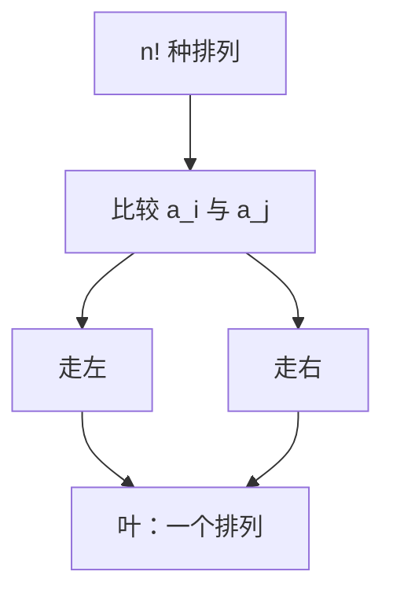

# 下界 Ω(n log n)

任何以比较为唯一信息的排序，在最坏情形下至少要问够区分 $n!$ 种排列的那些位。

<footer>—— 据 Ford and Johnson, A Tournament Problem, 1959；Knuth, TAOCP vol. 3；CLRS 第 8 章整理</footer>

上一课[三路快排](/cs/quicksort-3way)与更早的归并、堆排都停在 $O(n\log n)$ 比较。本课不重写分区。缺口是：这是巧合还是模型里的墙。没有下界，后课线性时间排序会看起来像「推翻了快排」。本课只钉**比较决策树**最坏高度 $\Omega(n\log n)$。

## 问题

比较排序每次问 $a_i\le a_j$ 或否，把输入排列集切成两块。要产出正确排列，树的叶必须至少覆盖 $n!$ 种可能（假定键互异）。二叉树高度至少 $\log_2(n!)$。Stirling：$n!=\omega\bigl((n/e)^n\bigr)$，故 $\log(n!)=\Omega(n\log n)$。

缺口因此不是再给一个 $O$ 算法，而是比较模型的信息量。渐近记号课已能写 $\Omega$；这里第一次把它用在**任意**该类算法上，而不只是某份伪代码。

### 下界不是「排序很慢」

它只约束**以两两比较为信息源**的过程。读键的数字、当桶下标、当基数的一位，都不在本模型里。那些是下一课的出口，不是对本课的反驳。

决策树每个内节点一次比较，叶是一个排列。最坏比较次数是树高。平均高度同样 $\Omega(n\log n)$，因为叶在第 $h$ 层最多 $2^h$ 个。信息论说法与计数说法是同一棵树。

## 方法

固定 $n$，键互异。任何比较排序对应一棵三路或两路树；本课用两路 $\le$。正确性要求每种排列走到某叶，且该叶输出该排列。因此 $h\ge\log_2(n!)=\Omega(n\log n)$。归并的 $\Theta(n\log n)$ 因此是比较模型最坏意义下渐近紧的（常数因子另算）。

相等键使排列变少，下界只更弱；算法仍常按互异分析。本课不把稳定排序的额外信息写进树。

## 机制

有了这堵墙，归并与堆排的最坏 $\Theta(n\log n)$ 不再是「还没优化好」。快排期望同阶，最坏越过墙之上（平方），墙管的是最坏下界，不管期望上界。后课若声称 $O(n)$，必须先声明离开比较模型。

对手论证：对手始终回答以保持尽可能多的一致排列，逼树走深。与决策树计数等价，本课不并行展开两套。

## 边界

本课不给出最优比较常数（Ford–Johnson 的精确最少比较是另一条线）。不处理部分信息（已知部分有序）。也不把 $\Omega(n\log n)$ 套到查找、选择：选择第 $k$ 小的比较下界是 $\Omega(n)$，不是 $n\log n$。

后课默认：比较排序最坏 $\Omega(n\log n)$。线性时间排序必须动用值域或位。

## 小结

- 比较决策树叶数 $\ge n!$，高度 $\Omega(n\log n)$。
- 墙只约束比较模型；不否定计数与基数。
- 归并/堆排最坏上界与此匹配。
- 出处：Knuth, TAOCP vol. 3；CLRS 第 8.1 节。
