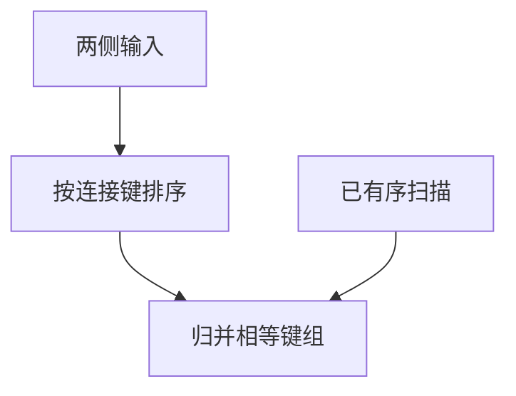

# 排序归并连接

两侧按连接键排序后，像归并两个有序表一样推进指针；等值与某些范围连接都自然。

<footer>—— 据 Blasgen and Eswaran；Ramakrishnan and Gehrke；对照外存排序</footer>

[上一课](/cs/nlj-hash-join)收了嵌套循环与哈希。本课不重做分区哈希。缺口是第三种形状：输入若已按键有序（B+ 叶扫描、聚簇），或付得起外存排序，归并连接一次扫过。它也服务非哈希友好的条件。下一课才把算子收成计划树。

## 问题

哈希要求等值且能选哈希函数。[外存排序](/cs/insertion-merge) 课已有归并。连接：两路归并时，键相等则做笛卡尔（在重复组内），然后前进较小的一侧。预排序代价高，但输出自然有序，可能帮下一算子。缺口是**有序归并这一物理合同**。

重复键组很大时，归并要能把一组物化或回绕，否则漏配。这是实现细节，规格仍是代数连接。

## 方法

若无序：外部排序两侧（或一侧），再归并。若一侧是有序索引扫描，只排另一侧。内存中可用替换选择产生初始顺串。本课不把并行排序的采样划分写完。

## 机制

归并把随机 I/O 换成顺序 I/O，和[局部性](/cs/locality-principle) 一致。与哈希对照：哈希探测是随机桶访问；归并是顺序。优化器后课用页数模型比较三者，而不是「哈希总是更快」。

## 边界

本课不引入 zigzag 连接当主干必选。如何把选择、连接、扫描排成树并交给执行器，下一课查询计划。

后课默认：三种物理连接都可用。执行的对象是计划树。

## 小结

- 排序归并对有序或可排序输入一次扫描。
- 输出有序可能被后续算子利用。
- 计划树下一课。
- 出处：Blasgen and Eswaran；Ramakrishnan and Gehrke。
