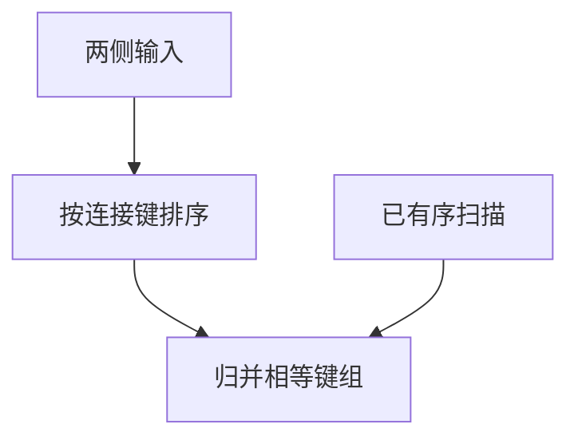
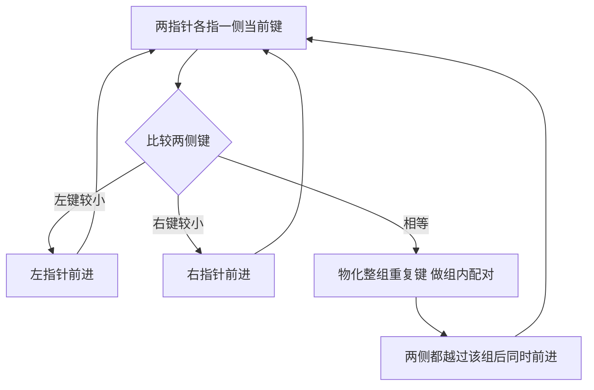

# 排序归并连接

两侧按连接键排序后，像归并两个有序表一样推进指针；等值与某些范围连接都自然。

<footer>—— 据 Blasgen and Eswaran；Ramakrishnan and Gehrke；对照外存排序</footer>

[上一课](/cs/nlj-hash-join)收了嵌套循环与哈希。本课不重做分区哈希。缺口是第三种形状：输入若已按键有序（B+ 叶扫描、聚簇），或付得起外存排序，归并连接一次扫过。它也服务非哈希友好的条件。下一课才把算子收成计划树。

## 问题

哈希要求等值且能选哈希函数。[外部排序](/cs/external-sort) 课已有归并。连接：两路归并时，键相等则做笛卡尔（在重复组内），然后前进较小的一侧。预排序代价高，但输出自然有序，可能帮下一算子。缺口是**有序归并这一物理合同**。

数字实例：两表按 id 各排好序，左指针停在 3、右指针停在 5——3 小于 5，左边不可能配上 5，左指针前进；两边同时走到 7 且各有一组重复行，就把整组做笛卡尔配对（比如每组 4 行就是 16 对）再一起越过。全程每页数据只顺序读一遍。

重复键组很大时，归并要能把一组物化或回绕，否则漏配。这是实现细节，规格仍是代数连接。

## 方法

若无序：外部排序两侧（或一侧），再归并。若一侧是有序索引扫描，只排另一侧。内存中可用替换选择产生初始顺串。本课不把并行排序的采样划分写完。

术语翻译：「物理合同」就是算子之间的接口承诺——上游保证交给下游的数据按某键有序。排序归并是这份合同最直接的受益者：上游若是 B+ 树叶扫描这种天然有序流，本算子连排序都省了；优化器正是靠物化这种性质砍掉整段排序节点。

```mermaid
flowchart TD
  IN["两侧输入"] --> SORT["按连接键排序"]
  SORT --> MG["归并相等键组"]
  IDX["已有序扫描"] --> MG
```

## 机制

归并把随机 I/O 换成顺序 I/O，和[局部性](/cs/locality-principle) 一致。与哈希对照：哈希探测是随机桶访问；归并是顺序。优化器后课用页数模型比较三者，而不是「哈希总是更快」。

```mermaid
flowchart TD
  P["两指针各指一侧当前键"] --> C{"比较两侧键"}
  C -- "左键较小" --> L["左指针前进"]
  C -- "右键较小" --> R["右指针前进"]
  C -- "相等" --> E["物化整组重复键 做组内配对"]
  E --> D["两侧都越过该组后同时前进"]
  L --> P
  R --> P
  D --> P
```

这张图回答「归并阶段两个指针到底怎么走」：小的那边先走，因为不可能配上对面更大的键；撞上相等键时不能逐行前进——要把整组重复物化或回绕，否则剩下的重复行会漏配，这正是正文提醒的实现坑。

## 边界

本课不引入 zigzag 连接当主干必选。如何把选择、连接、扫描排成树并交给执行器，下一课查询计划。

常见误区：以为「哈希连接总是更快」。哈希要为构建侧付内存与分区 I/O，而且只做等值；当输入本来就有序、或连接结果接下来还要按该键排序时，排序归并可能整份计划更省——优化器比的是总代价，不是单个算子的名气。

后课默认：三种物理连接都可用。执行的对象是计划树。

## 小结

- 排序归并对有序或可排序输入一次扫描。
- 输出有序可能被后续算子利用。
- 计划树下一课。
- 出处：Blasgen and Eswaran；Ramakrishnan and Gehrke。
