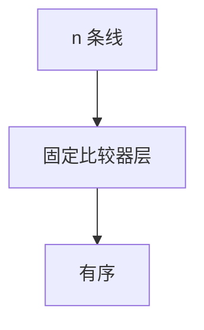

# 排序网络

比较器只交换两条线，数据无关控制；Batcher 双调 $O(\log^2 n)$ 层，Ajtai–Komlós–Szemerédi $O(\log n)$ 层存在但巨大。

<footer>—— 据 Batcher, Sorting Networks and Their Applications, 1968；Ajtai, Komlós and Szemerédi, 1983；Knuth TAOCP 卷 3 整理</footer>

上一课[work-span](/cs/work-span-model)是任务 DAG。排序网络：固定线路，每层并行比较。缺口是 0-1 原理与 Batcher。不重写快排期望。后课对手论证比较下界。Knuth 卷 3 是比较网络标准出处。

## 问题

比较器 $(i,j)$：若 $x_i\gt x_j$ 则交换。网络对任意输入正确 $\Leftrightarrow$ 对 0-1 输入正确（0-1 原理）。Batcher：奇偶归并、双调排序，$O(\log^2 n)$ 层、$O(n\log^2 n)$ 比较器。AKS：$O(\log n)$ 层，常数巨大。实践 Batcher 或 bitonic GPU。

缺口是无数据依赖控制，不是堆排序。

### 不是比较次数 $n\log n$ 下界的紧实现

信息下界 $\Omega(n\log n)$ 比较；网络深度另计。AKS 深度 $O(\log n)$ 达到并行最优量级，常数不实用。

Batcher 1968。AKS 1983。Knuth TAOCP 卷 3。后课对手论证 $\Omega(n\log n)$。

## 方法

画线。证明用 0-1。构造双调归并递归。计数层数。

插入网络 $O(n^2)$ 层，仅教学。

## 机制

0-1 原理：任意单调可分的错误会在 0-1 上显现。双调序列归并可递归拆半。与工作跨度：一层 = 一步跨度，工作 = 比较器总数。与 PRAM：网络是更弱、更规则的并行。

## 边界

本课不画 AKS  expander。不写量子排序。后课默认：实用排序网络 Batcher $O(\log^2 n)$ 层。下一课对手论证。

## 小结

- 数据无关比较器网络。
- 0-1 原理；Batcher $O(\log^2 n)$ 层。
- AKS 渐近更深优、常数大。
- 出处：Batcher, 1968；AKS, 1983；Knuth TAOCP 卷 3。
