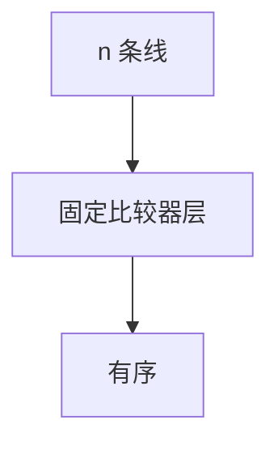
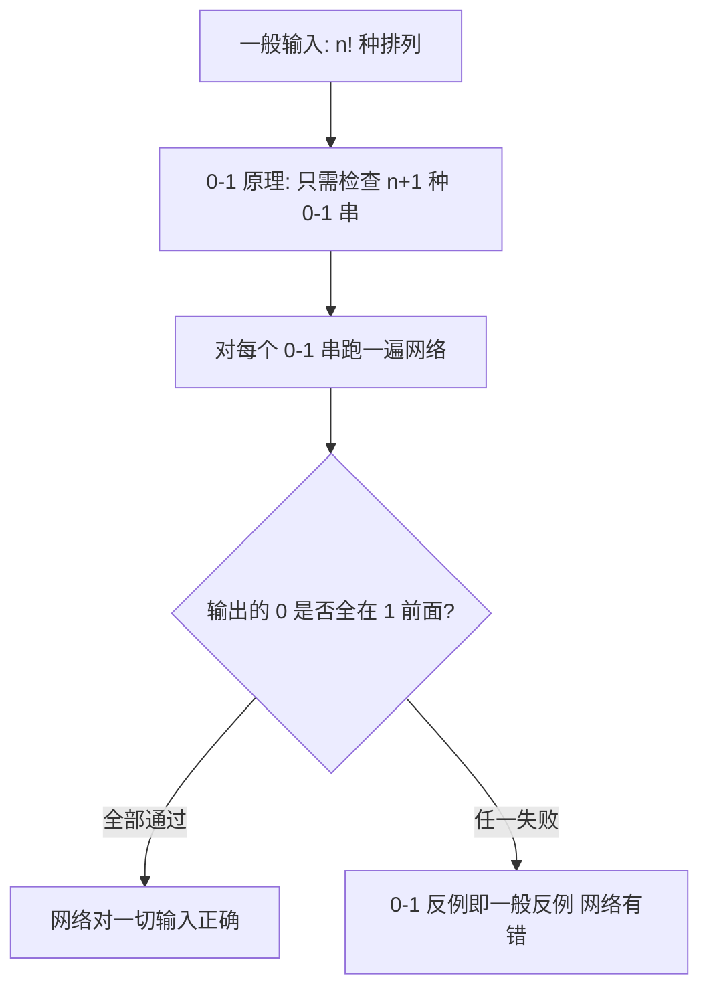

# 排序网络

比较器只交换两条线，数据无关控制；Batcher 双调 $O(\log^2 n)$ 层，Ajtai–Komlós–Szemerédi $O(\log n)$ 层存在但巨大。

<footer>—— 据 Batcher, Sorting Networks and Their Applications, 1968；Ajtai, Komlós and Szemerédi, 1983；Knuth TAOCP 卷 3 整理</footer>

上一课[work-span](/cs/work-span-model)是任务 DAG 的成本模型；排序网络把并行推到极端：线路固定，每层比较器同时动作，控制流与数据完全无关。缺口是 0-1 原理与 Batcher 构造。本课不重写快排期望；后课对手论证给比较下界。Knuth 卷 3 是比较网络的标准出处。

## 问题

比较器 $(i,j)$：若 $x_i\gt x_j$ 则交换两线，无分支、无数据依赖。0-1 原理：网络对任意输入正确 $\Leftrightarrow$ 对 0-1 输入正确——证明对象从 $n!$ 种排列塌缩成 $n+1$ 种 0-1 串。Batcher 用奇偶归并与双调排序做出 $O(\log^2 n)$ 层、$O(n\log^2 n)$ 个比较器的网络；AKS 证明 $O(\log n)$ 层存在，但常数巨大不实用。实践里 GPU 排序用的正是 Batcher 一族。

缺口是「无数据依赖的控制」，不是堆排序。

数字实例：0-1 原理的省力程度——$n=16$ 时一般输入要考虑 $16!\approx 2\times10^{13}$ 种排列，而 0-1 串只有 $17$ 种，验证对象一下塌缩约 12 个数量级；这正是排序网络能被穷举验证的原因。

### 不是比较次数 $n\log n$ 下界的紧实现

比较次数的信息下界 $\Omega(n\log n)$ 与网络深度是两本账：AKS 的 $O(\log n)$ 层在并行深度上达到最优量级，但比较器总数与常数不实用——渐近胜利不等于工程胜利。

Batcher 1968。AKS 1983。Knuth TAOCP 卷 3。后课对手论证 $\Omega(n\log n)$。

## 方法

方法是把线画出来：比较器层与连线构成图；正确性证明用 0-1 原理，把一般输入的检查化成对 0-1 串的检查；构造用双调递归——两个有序段接成双调序列后，归并网络递归拆半；最后数层数定深度。

```mermaid
flowchart TD
  IN["n 条线"] --> CMP["固定比较器层"]
  CMP --> OUT["有序"]
```

插入式网络要 $O(n^2)$ 层，只当教学样例。

直觉类比：比较器像一个固定岔口——两条线各走各的，到点比大小，大者换到指定那条线，全程没有 if。正因控制与数据完全无关，同一层的所有比较器可以同时开工，网络「层数」这个并行深度概念才成立。

## 机制

机制的根是 0-1 原理：比较器的行为只依赖两元素的相对序，任何对一般输入的失败都能经单调映射在某个 0-1 输入上显现——0-1 全对则全对。双调归并为什么成立：双调序列（先升后降）前后半对应元素两两比较后，各剩一个子双调且全体有序位置确定，递归拆半即完成归并。与 work-span 对上账：一层恰是一步跨度，比较器总数是工作。与 PRAM 比：网络是更弱但更规则的并行模型，可以直接译成硬件。

```mermaid
flowchart TD
  A["一般输入: n! 种排列"] --> B["0-1 原理: 只需检查 n+1 种 0-1 串"]
  B --> C["对每个 0-1 串跑一遍网络"]
  C --> D{"输出的 0 是否全在 1 前面?"}
  D -- "全部通过" --> E["网络对一切输入正确"]
  D -- "任一失败" --> F["0-1 反例即一般反例 网络有错"]
```

这张图回答「凭什么查 0-1 串就能担保所有输入」：任何一般输入的错误，都能经一个单调映射落到某个 0-1 串上同样出错——所以 17 个串全过等价于 $n!$ 种排列全过。验证从指数级缩到线性个案例。

## 边界

本课不画 AKS 的 expander 构造，不写量子排序。后课默认：实用排序网络取 Batcher 的 $O(\log^2 n)$ 层。下一课对手论证。

常见误区：把网络深度当比较次数。深度是最坏情形下一个元素串行经过的比较层数（决定时延），比较器总数才是总工作量（$O(n\log^2 n)$）；AKS 深度 $O(\log n)$ 却常数巨大——两个指标要分开读，混为一谈会误判实用性。

## 小结

- 数据无关比较器网络。
- 0-1 原理；Batcher $O(\log^2 n)$ 层。
- AKS 渐近更深优、常数大。
- 出处：Batcher, 1968；AKS, 1983；Knuth TAOCP 卷 3。
