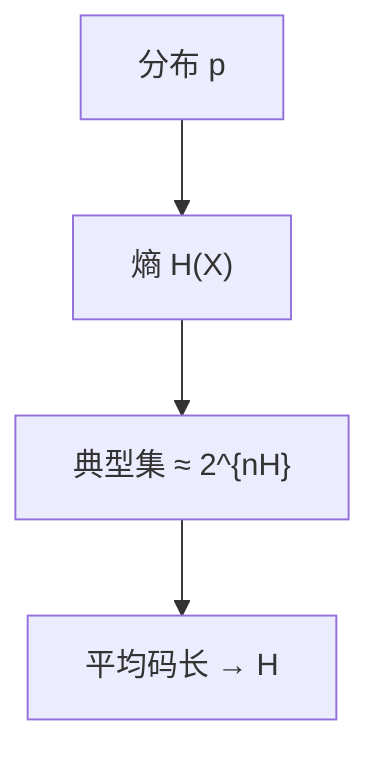

# 信源编码定理

i.i.d. 信源的压缩，平均每符号码长不能低于熵，也能任意接近熵；熵从此是可达到的下界，不是比喻。

<footer>—— 据 Shannon, 1948；Cover and Thomas, Elements of Information Theory 整理</footer>

复杂性单元在[BQP](/cs/bqp-intuition) 收束。本单元换尺子。[熵](/cs/entropy-bits) 已定义 $H(X)$，并声明压缩下界留给后课。缺口是**信源编码定理**（无噪声）：块长 $n\to\infty$ 时，平均码长 $\ge H$，且对任意 $\varepsilon$ 存在码 $<H+\varepsilon$。不重写自信息。

## 问题

符号来自分布 $p$，独立同分布。定长编码 $nH$ 量级比特不够覆盖全部 $\mathcal{X}^n$，但典型集大小约 $2^{nH}$，把非典型扔掉（小概率），即可用约 $nH$ 比特编号典型串。变长前缀码：期望长度 $L$ 满足 $H\le L<H+1$（Shannon 码、后课 Huffman）。定理的渐近形式用典型集；单符号形式用 Kraft 不等式。

[Kolmogorov](/cs/kolmogorov-complexity) 是单串最短程序；这里是分布上的期望码长。不要混。

### 熵仍不是文件字节数

UTF-8 文件长度是某编码的实现。定理说：相对真正的 $p$，你不能系统性地压过 $H$。模型错了，$H$ 算错，压缩器可以「看起来」压过错误模型的熵。

Shannon 1948 第 III 部分。Cover–Thomas 第 3、5 章。典型集：$-\frac1n\log p(x^n)\approx H$。本课不把 AEP 证完，只锁定可达与不可达。

## 方法

陈述：无损、i.i.d.、平均意义。画出典型集编号。点名 Kraft：前缀码长满足 $\sum 2^{-\ell_i}\le 1$，从而 $L\ge H$。下一课 Huffman 达到最优整数码长。

## 机制

有了下界，后课 Huffman、算术、LZ 都是逼近 $H$ 的构造，不是另起一种「信息量」。信道课将把噪声加回来：那里下界换成容量。本课信道是无噪声的：编码只为缩短，不为抗错。

块长换期望：单符号 Huffman 可能离 $H$ 差将近 1 比特；$n$ 块把差摊薄。

渐近等分：几乎所有长串的概率在 $2^{-n(H\pm\varepsilon)}$。非典型集概率 $\to 0$，故扔掉它们只损失可忽略的错误——无损版本用块末尾的溢出符号处理。有记忆源换成熵率 $H_\infty$；本课 i.i.d. 足够让 Huffman/算术/LZ 有共同靶子。

## 边界

本课不构造 Huffman，不谈有记忆信源的熵率（点名 $H(X_{n}|X^{n-1})$）。不引入有损。后课默认：无损压缩的一阶目标是 $H$。下一课 Huffman。

下界对真分布 $p$ 生效；模型错了，你「压过熵」只是压过了错误的 $H(\hat p)$。典型集解释块编码，Huffman 下一课给出单符号整数最优。

上一课留下的缺口在本课收口；「信源编码定理」进入后课词汇表后只引用。文献用来钉对象与边界，不把本课写成该主题的独立综述。

## 小结

- 无损 i.i.d.：平均码长以 $H$ 为下界且可逼近。
- 典型集解释「为什么不必给所有串留号」。
- 与 $K(x)$ 分工：期望 vs 单串。
- 出处：Shannon, 1948；Cover and Thomas。
