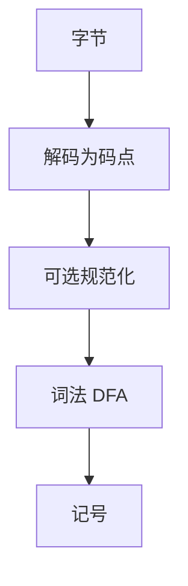

# 源码编码与 Unicode 词法

词法的字母表不是「字节」。规范化、BOM、同形字与标识符字符类决定两个源文件是不是同一个程序。

<footer>—— 据 Unicode 标准标识符附录；ISO C/C++ 通用字符名；Peyton Jones 等对 Haskell 词法的讨论整理</footer>

上一课[C 预处理器](/cs/c-preprocessor)假定已经有了「记号」。更早的翻译阶段是**物理编码**：UTF-8、续行、三字符组（历史）、通用字符名 `\uXXXX`。主干[正则与词法](/cs/regex-lexer)用 ASCII 讲最长匹配。缺口是**字母表真正是什么**，以及 lex 规则在 Unicode 下如何仍保持确定扫描。本课收束前端进阶课序，不重写 UTF-8 编解码课的全部位模式。

## 问题

同一标识符可有预组合与分解形式（NFC/NFD）。语言必须规定：先规范化再比较，还是按字节比较。BOM 在文件头不是标识符。零宽字符可把两个看起来一样的名字拆开——工具链要不要拒。缺口是**词法字母表与等价**，不是再画 DFA 子集构造。

flex 默认字节；要认 Unicode 标识符需字符类与编码转换，否则正则 `.` 的意义漂在 UTF-8 续字节上。

### 同形字不是正则冲突

`latin a` 与 `cyrillic а` 是不同码点，DFA 可以区分。人不可区分。这是诊断与安全策略，不是 NFA 等价问题。不要用「加一条正则」假装解决。

Unicode UAX #31（标识符）。C++ 的 UCN 与 raw string 改变词法最长匹配。本课不进入显示层 Bidirectional 全部算法，只点名源码欺骗（Trojan Source）是词法+渲染问题。

## 方法

规定源编码（或探测 UTF-8）。解码为码点流，再跑词法 DFA。标识符：`XID_Start`/`XID_Continue` 或语言自己的表。字符串字面量：转义、原始字符串、换行规则与 lex 起始条件（[lex](/cs/lex-flex)）对齐。

cpp 的 `\u` 发生在特定阶段，可能在规范化之前或之后——必须按语言标准钉死，不能凭直觉。

## 机制

最长匹配在码点上，不在字节上：多字节字符不能从中切开。错误恢复跳过非法 UTF-8 序列时，行号与列要按语言的列定义（码点或显示宽）报告。

PEG/Pratt 若直接吃字节，会把 UTF-8 当运算符碎片。前端进阶课序到此：生成器、通用分析、宏、编码——下一单元从无类型 λ 走到类型。

## 边界

本课不写字体渲染，不规定编辑器是否做 confusable 警告。后课默认：词法字母表是码点（或标准规定的规范化码点）。下一课[简单类型 λ](/cs/simply-typed-lambda) 接主干 λ 与类型检查，不再处理 BOM。

也不把 GBK 与 UTF-8 混用当可移植源。

## 小结

- 词法在码点（及规定的规范化）上跑，不在生字节上。
- Unicode 标识符类与同形字是不同层。
- 与 lex/cpp 的阶段顺序必须按语言标准。
- 出处：Unicode UAX #31；ISO C/C++ 词法；对照 Thompson/龙书正则词法。
