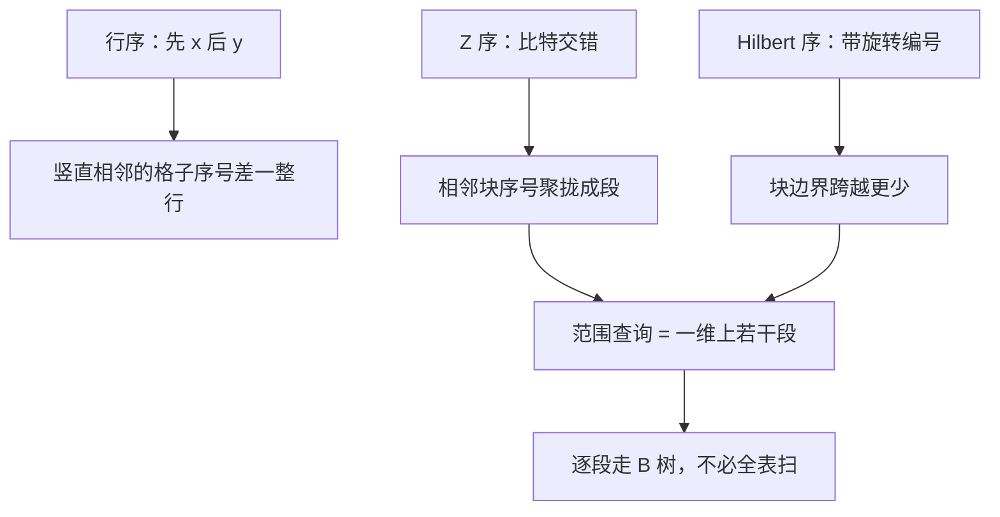

# 空间填充曲线

用一条连续折线串起网格单元，使空间相邻尽量在一维上也相邻；B 树与缓存看见的是这个线性序。

<footer>—— 据 Hilbert, Über die stetige Abbildung einer Linie auf ein Flächenstück, 1891；Morton, A Computer Oriented Geodetic Data Base, 1966；Samet 整理</footer>

[上一课](/cs/quadtree-octree) 给出象限。外存与[局部性](/cs/locality-principle) 要的是一维扫描序。[R 树](/cs/r-tree) 插入也可按 Hilbert 值排序打包。本课不切立方体。缺口是空间填充曲线：Morton（Z 序）与 Hilbert，把坐标比特交错或按旋转状态机编号。

## 问题

二维键 $(x,y)$ 若先排 $x$ 再排 $y$，竖条相邻在一维上可能很远。Z 序：交错 $x,y$ 的比特，四叉块在序上成一段。Hilbert：更保持邻接，构造用状态与旋转。缺口是**多维网格上的双射编号**，使范围查询变成一维上若干段（不是一段）。

数字实例：$8\times 8$ 网格上，水平相邻的 $(0,7)$ 与 $(1,7)$：行序编号是 7 和 15，差 8；Z 序把 $x,y$ 的比特交错后分别编成 42 和 43，只差 1。「空间相邻在一维上也相邻」说的就是这个差值从 8 缩到 1。

Hilbert 1891 是分析学构造；数据库用离散网格版。Morton 1966 报告给出 Z 序。本课不把连续统曲线当作业。

## 方法

Z 序：`code = interleave(x,y)`，比较即比较整数。范围查询：在 Z 空间上走，遇到出矩形则跳到下一可能码（clz 等技巧）。Hilbert：查表或迭代，编码稍贵，局部性通常更好。用于：把点排序后bulk-load R 树；缓存友好的矩阵分块遍历。

与 k-d / R：曲线不替代几何剪枝，只提供序。高维 Z 序仍交错，段数变多。

直觉类比：Z 序像走之字形，每到块边界要「跳远」一格；Hilbert 像按规则不停左转右转的走迷宫笔法，笔尖尽量不抬起来——所以序号相邻的格子几乎总是空间相邻，邻接保持得更好。

## 机制

四叉树叶的 Z 序恰好是深度优先象限序的一种。Hilbert 在块边界更少「空间近、序号远」。不要声称任意形状查询都变成单区间——正交矩形在 Z 序上是 $O(\sqrt{n})$ 段一类现象，分析视查询而定。

这张图回答的是：三种线性化序对「空间邻接」的保持程度差在哪，以及范围查询为什么是「若干段」而不是一段。

平衡堆与空间课序在此结束。下一单元字符串：后缀数组把「所有后缀的字典序」收成一维，不再是几何曲线。

## 边界

本课不写空间填充曲线上的并行划分全部论文。不进入金融订单簿。字符串后缀排序是另一课序。

后课默认：需要把网格线性化时用 Z/Hilbert。后缀排序从后缀数组开始。

常见误区：初学者容易以为矩形范围查询在 Z 序上是一段连续区间。实际上一个矩形会裂成若干段（数量与查询形状相关），实现要沿序跳跃式取段，而不是一次二分查完。

## 小结

- Z 序比特交错，Hilbert 更保邻接。
- 服务一维索引与 bulk-load，不是几何树的替代。
- 下一课程单元：后缀与哈希。
- 出处：Hilbert, 1891；Morton, 1966；Samet。
