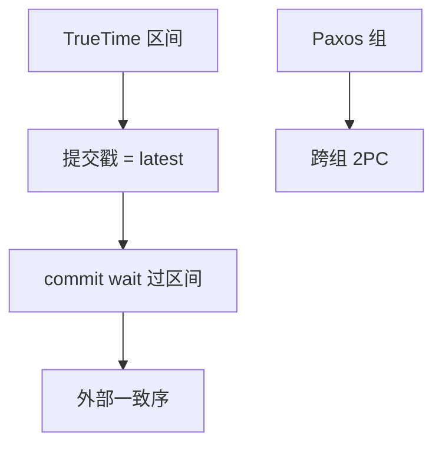

# Spanner 与 TrueTime

TrueTime 给出带误差界的时钟区间；提交等待直到区间过去，时间戳序才与真实时间外部一致。

<footer>—— 据 Corbett et al., Spanner: Google's Globally-Distributed Database, OSDI 2012</footer>

[上一课](/cs/percolator)用时间戳服务器。本课把戳绑到物理时间：Spanner 的 TrueTime API 返回 $[t_{earliest}, t_{latest}]$，提交时间戳取 $t_{latest}$ 并 **commit wait** 等到该时间真正经过。外部一致性（external consistency）：若 T1 提交结束后 T2 才开始，则 T2 的戳更大。缺口是时钟不确定度，不是再讲 2PC。

## 问题

跨数据中心线性一致通常要共识。Spanner：数据 Paxos 组，事务跨组 2PC，时间戳来自 TrueTime。若不等待，T2 可能拿到更早戳。commit wait 用 $\epsilon$ 换外部序。缺口是 **$\epsilon$ 大则写延迟大**；GPS/原子钟把 $\epsilon$ 压到毫秒级，这是硬件合同。

读：当前读可能等，快照读带过去时间。与读己之写：全局戳可比较。

Corbett et al. OSDI 2012。Cockroach 用 HLC 近似，无 Google 真时钟。本课 TrueTime 机制。计算机栏 HLC 课可对照，此处不重推混合逻辑钟。

## 方法

写事务：锁、2PC、打 TT.now().latest、等待。只读：选时间戳不阻塞写者（在 $\epsilon$ 规则下）。目录：分片与 Paxos 组的元数据也是 Spanner 表。

与 Calvin：Spanner 非确定性调度+锁+真时间；Calvin 定序日志。两条外部一致路线。

## 机制

故障：Paxos 选主，RPO 由多数盘决定。RTO 含选举。$\epsilon$ 抖动直接进尾延迟。隔离：可串行、外部一致，比 SI 强。

SQL：Spanner 提供 SQL，优化器仍要分片裁剪与 shuffle——本课不重做连接。

## 边界

本课不讲分布式死锁检测算法。也不把 Spanner 当「有了就不需要校准代价模型」。NewSQL 课归类。

后课默认：真时间+等待可得外部一致时间戳。分布式死锁：2PC 与锁跨组时 WFG 跨网络。

没有误差界的 NTP 不能当 TrueTime 用。

## 小结

- TrueTime 区间 + commit wait 给出外部一致戳。
- 存储用 Paxos，跨组 2PC；$\epsilon$ 进入写延迟。
- 分布式死锁下一课。
- 出处：Corbett et al., OSDI 2012。
